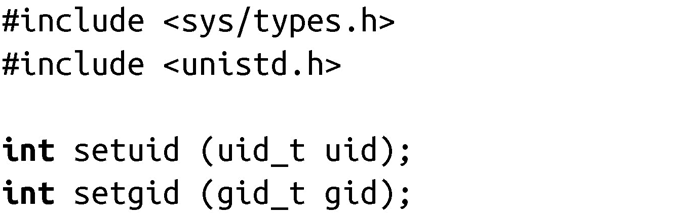

### 5.6.1　改变实际用户/组ID和保留的用户/组ID

用户ID和组ID是通过下面两个系统调用来设置：

调用setuid()会设置当前进程的有效用户ID。如果进程当前的有效用户ID是0（root），那么也会设置实际用户ID和保留的用户ID的值。root用户可以为uid提供任何值，从而把所有三种用户ID的值都设置成uid。非root用户只允许将实际用户ID和保留的用户ID设置为uid。也就是，非root用户只能将有效用户ID设置为上述中的一个值。

调用成功时，setuid()返回0。出错时，返回-1，并把errno设置为下面的值之一：

EAGAIN　uid值和实际用户ID值不同，把实际用户ID设置成uid会导致此用户拥有的进程数超过上限RLIM_NPROC的rlimit值（它定义了一个用户可以拥有的进程数上限）。

EPERM　不是root用户，uid既不是有效用户ID也不是保留的用户ID。

上面的讨论对组也是适用的，只需要将setuid()替换为setgid()，把uid替换为gid。

