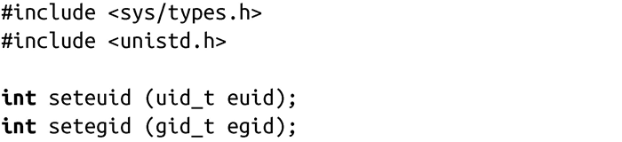

### 5.6.2　改变有效的用户ID或组ID

Linux提供了两个POSIX所定义的函数，可以设置当前正在执行进程的有效用户ID和组ID的值：

调用seteuid()会把有效用户ID设置为euid。root用户可以为euid提供任何值。而非root用户只能将有效用户ID设置为有效用户ID或者是保留的用户ID。成功时，setuid()返回0。失败时，返回-1，并把errno设置为EPERM。它表示当前进程的所有者不是root用户，并且euid的值既不等于实际用户ID也不等于保留的用户ID。

注意，对于非root用户来说，seteuid() 和setuid()的行为是完全一样的。因此，当进程需要以root权限来运行时，使用setuid()更合适一些，否则使用seteuid()应该是更好的解决方案。

同样，前面的讨论对组也是适用的，只需要将seteuid()替换为setegid()，把euid替换为egid。

