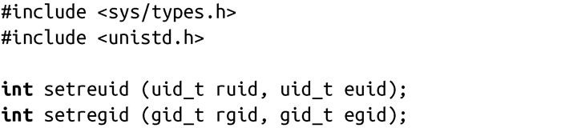

### 5.6.3　BSD改变用户ID和组ID的方式

BSD在改变用户ID和组ID上有自己的接口。出于兼容性考虑，Linux也提供了这些接口：

调用setreuid()会分别将实际用户ID和有效用户ID设置成ruid和euid。将这两个参数中的任何一个设置为-1都不会改变相应的用户ID值。非root用户的进程只允许将有效用户ID设置为实际用户ID或者是保留的用户ID，或把实际用户ID设置为有效用户ID。如果实际用户ID发生了变化，或者有效用户ID被修改成不是先前的实际用户ID，那么保留的用户ID就会修改成新的有效用户ID。至少，Linux或其他UNIX系统是这么处理的。但是对于POSIX，这些都是未定义的行为。

成功时，setreuid()返回0，出错时返回-1，并把errno值设置为EPERM，表示当前进程的所有者不是root用户，并且euid的值既不等于实际用户ID也不等于保留的用户ID，或者ruid不等于有效用户ID。

同样，前面的讨论对组也是适用的，只需要将setreuid()替换为setregid()，把ruid替换为rgid，把euid替换为egid。

