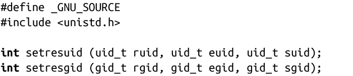

### 5.6.4　HP-UX中改变用户ID和组ID的方式

你可能已经感到有些混乱了，但是HP-UX(Hewlett-Packard’s UNIX系统)也有自己设定用户ID和组ID的方式。Linux同样也提供了这些接口，如果要和HP-UX兼容，需要使用这些接口：

调用setresuid()会分别将实际用户ID、有效用户ID和保留的用户ID设置为ruid、euid和suid。把这几个参数中的任何一个值设置为-1表示不会改变相应的用户ID。

root用户可以把用户ID设置为任意值。非root用户只可以把用户ID设为当前的实际用户ID、有效用户ID和保留的用户ID。成功时，setresuid()<a class="my_markdown" href="['#anchor56']">[6]</a>返回0。出错时返回0，并把errno设置为下列值之一：

EAGAIN　uid和实际用户ID不同，把实际用户ID设置为uid会导致此用户的进程数超过上限RLIM_NPROC的rlimit（它定义了一个用户可以拥有的进程数上限）。

EPERM　不是root用户，并试图设置的新的实际用户ID、有效用户ID或保留的用户ID，它们和当前的各个相应ID值不匹配。

前面的讨论对组也是适用的，只需要将setresuid()替换为setresgid ()，ruid替换为rgid，euid替换为egid，suid替换为sgid。

