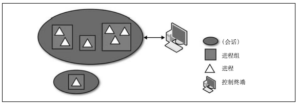

### 5.7　会话（Session）和进程组

每个进程都属于某个进程组。进程组是由一个或多个为了实现作业控制而相互关联的进程组成的。进程组的主要特征就是信号可以发送给进程组中的所有进程：单个操作可以使同一个进程组中的所有进程终止、停止或者继续运行。

每个进程组都是由进程组ID（pgid）唯一的标识，并且都有一个“进程组首进程”（process group leader）。进程组ID就是进程组首进程的pid。只要在某个进程组中还有一个进程存在，则该进程组就存在。即使进程组首进程终止了，该进程组依然存在。

当有新的用户登录计算机时，登录进程就会为这个用户创建一个新的会话。这个新的会话只包含单个进程：用户的登录shell（login shell）。登录shell被作为“会话首进程（session leader）”。会话首进程的pid就被作为会话ID。会话是一个或多个进程组的集合。会话囊括了登录用户的所有活动，并且分配给用户一个控制终端（controling terminal）。控制终端是用于处理用户I/O的特定tty设备。因此，会话的功能和shell差不多。实际上，没有谁刻意去区分它们。

虽然进程组提供了向其中所有进程发送信号的机制，这使得作业控制和其他的shell功能变得很容易，此外，会话把登录和控制终端联系起来。会话中的进程组分为一个前端进程组以及零个或多个后台进程组。当用户退出终端时，会向前端进程组中的所有进程发送SIGQUIT信号。当终端发现网络中断的情况时，会向前端进程组中的所有进程发送SIGHUP信号。当用户敲入了终止键（一般是Ctrl+C），会向前端进程组中的所有进程发送SIGINT信号。因此，会话使得shell可以更容易管理终端以及登录行为。

回顾一下，假设某个用户登录系统，她登录的shell是bash，并且pid是1700。登录用户的bash实例成为新进程组中的唯一进程，也是进程组首进程。这个进程组所在会话的会话ID是1700，而且bash成为这个会话中的唯一进程。用户在shell中运行的命令在新的进程组中以1700会话运行。在进程组中，直接和用户打交道并控制终端的进程，是前端进程组。其他的进程组都是后台进程组。

在指定的系统中，存在着多个会话：每个用户的登录都是一个会话，还有一些是与用户登录会话无关的进程（例如守护进程）。守护进程往往会创建自己的会话，从而避免与其他存在的会话产生关系。

每个会话都包含着一个或多个进程组，而且每个进程组至少包含一个进程。包含多个进程的进程组通常是用来完成作业控制的。

如下的shell命令：

这条shell命令会产生由三个进程构成的一个进程组。以这种方式，shell可以向三个进程同时发送信号。因为用户直接敲入了这条命令，而且结尾没有使用“&”符号，所以它是一个前端进程组。图5-1显示了会话、进程组、进程和控制终端之间的关系。

<b class="my_markdown">图5-1　会话、进程组、进程及控制终端之间的关系</b>

Linux提供了几个接口，可以设置与获取与给定进程相关的会话进程组。这几个接口主要是为shell服务的，但是也可用于像守护进程之类的进程，因为守护进程不希望与会话和进程组有任何关系。

