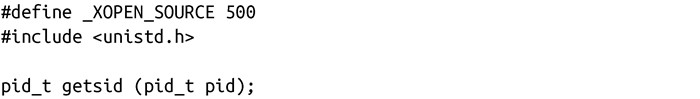
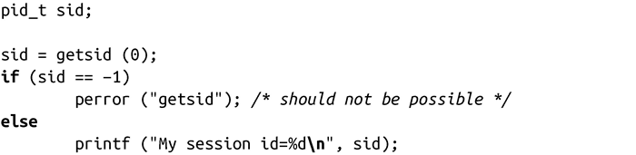

### 5.7.1　与会话相关的系统调用

在登录时，shell会创建新的会话。这是通过一个特殊的系统调用来完成的，用它可以很容易创建会话：

假如调用进程不是某个进程组首进程，调用setsid()会创建新的会话。调用进程就是这个新建会话的唯一进程，也是它的首进程，但是它没有控制终端。同时，调用setsid()还会在这个会话内创建新的进程组，调用进程成为了首进程，也是进程组中的唯一进程。新会话ID和进程组ID都被设置为调用进程的pid。

也就是说，setsid()创建新的会话，并在其中创建一个新的进程组，而且使得调用进程成为新会话的首进程和新进程组的首进程。对于守护进程来说，这十分有用，因为它不想是任何已存在会话的成员，也不想拥有控制终端。对于shell来说，它也很有用，因为shell希望为每一个登录的用户创建新的会话。

成功时，setsid()会返回新会话的会话ID。出错时，返回-1，并把errno设置为EPERM，表示调用进程是是当前进程组的首进程。使任何进程不成为首进程的最简单的方式是先创建一个新进程，并终止父进程，然后让子进程来调用setsid()。如下：

虽然获得当前进程的会话ID不是很常用，但也是可以做到的：

对getsid()的调用会返回进程pid的会话ID。如果参数pid是0，就返回调用进程的会话ID。出错时，返回-1，而errno的唯一可能值就是ESRCH，其含义是pid不表示任何有效进程。注意，在其他的UNIX系统中，可能也会把errno设置为EPREM，表示pid进程和调用进程不属于同一个会话。Linux不会这么处理，而是会返回任意一个进程的会话ID。

getsid()很少使用，它主要用于诊断问题：

