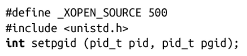
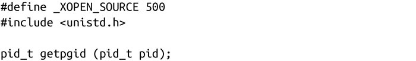
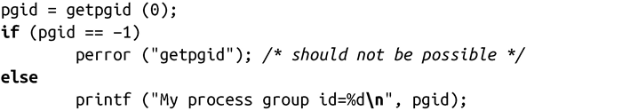

### 5.7.2　与进程组相关的系统调用

setpgid()调用会把pid进程的进程组ID设置为pgid：

如果pid是0，则使用调用者的当前进程ID。如果pgid是0，则将pid的进程ID设置为进程组ID。

成功时，返回0。成功必须依赖以下几个条件：

+ pid进程必须是调用进程或者是其子进程，而且子进程没有调用过exec函数并且和pid进程在同一个会话中。
+ pid进程不能是会话首进程。
+ 如果pgid已经存在，它必须与调用进程在同一个会话中。
+ pgid必须为非负值。

出错时，返回-1，并把errno设置为下列值之一：

EACCESS　pid进程是调用了exec函数的调用进程的子进程。

EINVAL　pgid小于0。

EPERM　pid进程是会话首进程，或者是与调用进程不在同一个会话中。也可能是试图把一个进程放到不在同一个会话的进程组中。

ESRCH　pid不是当前进程、0或当前进程的子进程。

可以通过会话获得进程的进程组ID，虽然这种做法用处不大：

getpgid()返回pid进程的进程组ID。如果pid是0，返回当前进程的进程组ID。出错时，返回-1，并把errno设置成唯一可能值是ERSCH，表示pid是个非法的进程标识符。

与getsid()类似，getpgid()也主要用于诊断错误：

