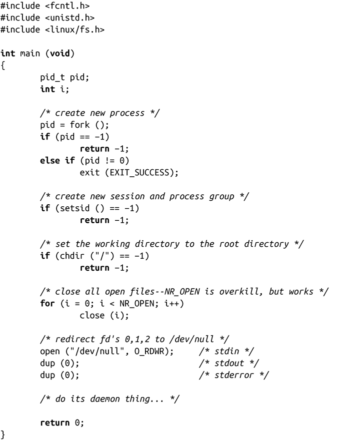

### 5.8　守护进程

守护进程运行在后台，不与任何控制终端相关联。守护进程通常在系统启动时就运行，它们以root用户或者其他特殊的用户（例如apache和postfix）运行，并处理一些系统级的任务。习惯上守护进程的名字通常以d结尾（就像crond和sshd），但这不是必需的，甚至不是通用的。

> 这个名字的由来源于Maxwell’s demon，它是物理学家James Maxwell在1867年进行的一个思想实验。Daemon这个词也是希腊神话中的鬼怪，它存在于人类和神之间，拥有占卜的能力。与Judeo-Christian神话中的daemon不同，希腊神话中的daemon不是邪恶的。实际上，神话中的daemon是神的助手，做一些奥林匹斯山的居民自己不愿做的事——很像UNIX中的守护进程，完成前端用户不愿做的事。

对于守护进程，有两个基本要求：一是必须作为init进程的子进程运行，一是不与任何控制终端交互。

一般来讲，进程可以通过以下步骤成为守护进程。

1．调用fork()，创建新的进程，该进程将会成为守护进程。

2．在守护进程<a class="my_markdown" href="['#anchor57']">[7]</a>的父进程中调用exit()。这会确保父进程的父进程（即守护进程的祖父进程）在其子进程结束时会退出，保证了守护进程的父进程不再继续运行，而且守护进程不是首进程。最后一点是成功完成下一步骤的前提。

3．调用setsid()，使得守护进程有一个新的进程组和新的会话，并作为二者的首进进程。这也保证不存在和守护进程相关联的控制终端（因为守护进程刚创建了新的会话，不会给它分配一个控制终端）。

4．通过调用chdir( )，将当前工作目录改为根目录。因为守护进程是通过调用fork()创建来创建，它继承来的当前工作目录可能在文件系统中的任何地方。而守护进程往往会在系统开机状态下一直运行，我们不希望这些随机目录一直处于打开状态，导致管理员无法卸载守护进程工作目录所在的文件系统。

5．关闭所有的文件描述符。我们不希望继承任何打开的文件描述符，不希望这些描述符一直处于打开状态而自己没有发现。

6．打开文件描述符0、1和2（标准输入、标准输出和标准错误），并把它们重定向到/dev/null。

下面这个程序遵循了以上这些规则，可以成为守护进程：

许多UNIX系统在它们的C函数库中提供了daemon()函数来自动完成这些工作，从而简化了一些繁琐的工作：

如果参数nochdir是非0值，就不会将工作目录改为根目录。如果参数noclose是非0值，就不会关闭所有打开的文件描述符。如果父进程设置了守护进程的这些属性，那么这些参数是很有用的。通常都会把这些参数设为0。

成功时，返回0。失败时，返回-1，并将errno设置为调用fork()或setsid()的错误码之一。

