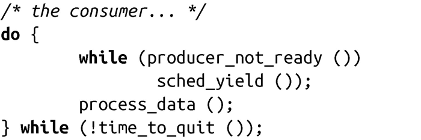

### 合理使用

实际上，在Linux系统这样的抢占式多任务系统中，很少有合理使用sched_yield()的机会。内核完全有能力做出最优化、最有效率的调度决策，这是因为内核显然比一个独立的应用程序更懂得应该何时抢占哪个进程。这正是操作系统放弃协同式多任务机制，而采用抢占式多任务机制的原因。

那么，为什么POSIX会提供这种“重新调度”的系统调用呢？这是因为应用需要等待一些外部事件，比如用户、硬件组件或者其他进程所触发的外部事件。例如，如果一个进程需要等待另一个进程，直观的解决方案是“让出处理器，直到另一个进程完成”。一个简单的消费者/生产者模型实现可能看起来如下：

幸运的是，UNIX程序员一般不需要编写这样的代码。UNIX程序通常是事件驱动的，往往会在消费者和生产者之间利用阻塞机制（比如管道）来代替sched_yield()。在这种情况下，消费者从管道中读取数据，在必要的时候阻塞等待数据。生产者则在有新数据时就向管道写数据。通过这种机制，可以避免用户空间进程之间的协同工作，而是把这些工作交给了内核；对于内核而言，又可以通过使进程睡眠，并在需要的时候以激活的方式来优化管理。一般来说，UNIX程序会致力于使用事件驱动机制，它需要可阻塞文件描述符。

最近，有一种场景非常迫切需要sched_yield()调用：用户空间线程锁。当一个线程试图请求的锁已经被另一个线程持有时，该线程会让出处理器直到锁可用。在内核不支持用户空间锁的时候，这种方法最简单高效。然而，现代Linux的线程实现（the Native POSIX Threading Library, NPTL）引入了一个基于快速用户互斥锁（futexes）的优化方案，它在内核中提供对用户空间锁的支持。

sched_yield()的另一个合理使用场景是“表现友好（playing nicely）”：一个处理器密集的程序可以周期性调用sched_yield()，减少对系统的影响。这个策略的出发点很不错，但是存在两个缺点。第一，内核可以比一个独立进程做出更好的全局调度决策，因此，使系统操作更平滑的工作应该由调度器来承担，而不是用户进程。第二，减轻处理器密集应用带来的负担，从而保证其他应用可以运行，这是用户的责任，而不是某个应用。用户可以通过shell命令“nice”为应用程序设置偏好，本章后面将会探讨它。

