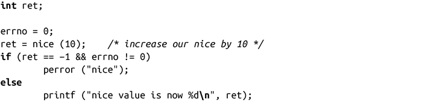
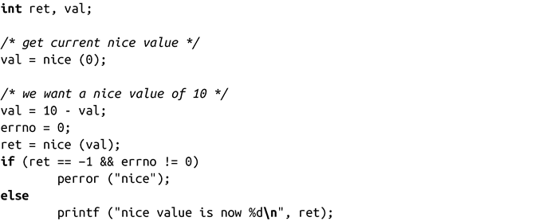

### 6.4.1　nice()

Linux提供了获取和设置进程nice value的系统调用。最简单的方式是调用nice()：

nice()调用成功时，会在现有的nice value上增加inc，并返回更新后的值。只有拥有CAP_SYS_NICE权限的进程（实际上即进程所有者为root）才可以使用负值inc，减少nice value，从而提升该进程的优先级。因此，非root用户的进程只能降低优先级（增加nice value）。

出错时，nice()返回-1。但是，由于nice()调用会返回更新后的值，-1也可能是成功时的返回值。因此，为了判断调用是否成功，在调用前应该先把errno值置为0，然后，在调用后再检查errno值。举个例子：

对于nice()，Linux只会返回一种错误码：EPERM，表示调用的进程试图提高其优先级（传递int值为负数），但没有CAP_SYS_NICE权限。当nice value超出指定范围时，其他系统还会返回 EINVAL，但Linux不会。相反，Linux会把非法值通过四舍五入方式获取对应值，或者当超出指定范围值时，就设置成下限值。

获得当前优先级的一种简单方式是给nice()函数传递参数0：

通常，当进程需要设置绝对优先级而不是相对增量的时候，可以使用如下代码：

