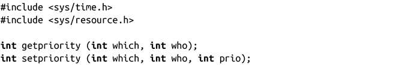
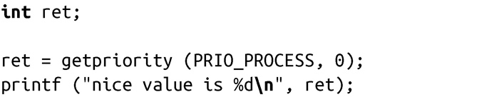
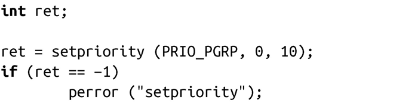

### 6.4.2　getpriority()和setpriority()

要修改进程优先级，更好的解决方案是通过getpriority()和setpriority()系统调用，这两个调用支持更多控制功能，不过使用起来也更复杂：

这两个系统调用可以作用于由参数“which”和“who”指定的进程、进程组或用户。其中，“which”的取值必须是 PRIO_PROCESS、 PRIO_PGRP 或PRIO_USER，而“who”则指定了进程ID、进程组ID或用户ID。当“who”的值是0时，调用分别是在当前进程、当前进程组或当前用户上运行。

调用getpriority()会返回任何指定进程的最高优先级（即nice value最小），调用setpriority()则将所有进程的优先级都设置为“prio”。和nice()一样，只有拥有CAP_SYS_NICE权限的进程可以提升进程的优先级（降低其nice value）。此外，只有拥有这样权限的进程才可以调整那些不属于当前用户的进程的优先级。

出错时，getpriority()会返回-1。同nice()返回值类似，-1也可能是成功的返回值，因此为了处理错误情况，编程人员必须在调用前把error清0。相反地，setpriority()就没有这些问题：它总是成功时，返回0；出错时，返回-1。

以下代码会返回当前进程优先级：

以下代码会把当前进程组的所有进程优先级都设置为10：

出错时，函数会把errno设置为以下几个值之一：

EACCES进程试图提高进程优先级，但没有CAP_SYS_NICE权限（仅适用于setpriority()）。

EINVAL 参数“which”的值不是PRIO_PROCESS、PRIO_PGRP或PRIO_USER。

EPERM 指定的进程有效用户ID和调用进程有效用户ID不一致，且调用进程没有CAP_SYS_NICE权限（仅适用于setpriority()）。

ESRCH 不存在匹配参数“which”和“who”所指定值的进程。

