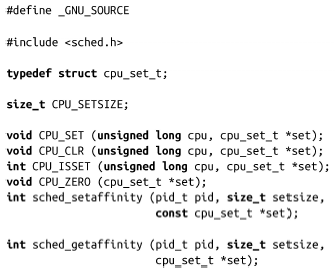
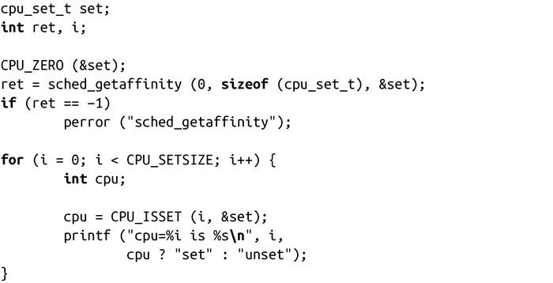
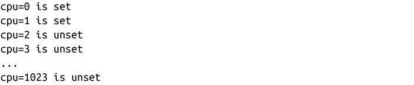
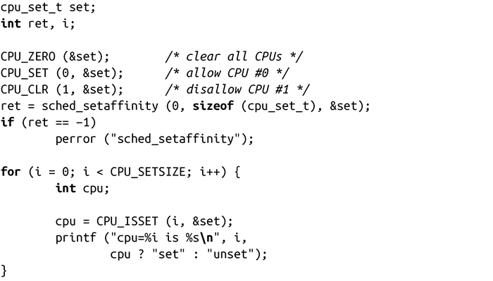
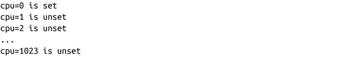

### sched_getaffinity()和sched_setaffinity()

子进程会从父进程那里继承处理器亲和力，在默认情况下，进程可以运行在任何CPU上。Linux提供两个系统调用来获取和设定进程的“硬亲和力”：

调用sched_getaffinity()可以获得由“pid”指定的进程的处理器亲和力，保存在特定类型cpu_set_t中，可以用特殊的宏来访问。如果pid值是0，则返回当前进程的亲和力。参数setsize是cpu_set_t类型的大小，glibc用它来保证将来类型变化时依然具有兼容性。成功时，函数sched_getaffinity()返回0；出错时，返回-1，并设置errno值。代码示例如下：

在调用前，我们调用CPU_ZERO()函数，把所有的二进制位清零，然后对集合set从0到CPU_SETSIZE进行迭代。注意，CPU_SETSIZE并不是set的大小，这一点很容易让人误解——一定不要把它作为setsize()函数的参数，相反，CPU_SETSIZE是指set可能表示的处理器数量。由于当前实现是通过1个二进制位来表示一个处理器，因此，CPU_SETSIZE实际上比sizeof(cpu_set_t)大得多。我们通过CPU_ISSET检查系统中某个处理器i是否被绑定到这个进程，0表示未绑定，非0表示绑定。

只对系统中物理真实存在的处理器进行设置，因此，在双核系统上运行上述代码会得到如下结果：

从输出中可以看到，当前的CPU_SETSIZE值（从0开始）是1 024。

由于系统是双核的，我们只考虑CPU #0和#1这两个处理器。可能我们期望确保进程只运行在CPU #0上，而不会运行在#1上。代码如下：

首先，我们通过CPU_ZERO把set清零，然后通过CPU_SET把CPU #0置成1，用CPU_CLR把CPU #1置0。前面已经对整个set清零，所以这里执行CPU_CLR是多余的，这里提供仅仅是出于完整性考虑。

在同一台双核系统上运行该程序，其输出结果会和之前的稍有差别：

现在，CPU #1已经被禁用，不论如何执行，该进程总是运行在CPU #0上。

可能的错误值有以下四种：

EFAULT

提供的指针在进程的地址空间外或非法。

EINVAL

系统中没有处理器被允许调度（仅适用于sched_setaffinity()），或者setsize小于内核中表示处理器集合的内部数据结构的大小。

EPERM

pid指向的进程不属于当前调用进程的有效用户ID，而且该进程没有CAP_SYS_NICE能力。

ESRCH

pid指定的进程不存在。

