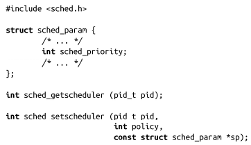
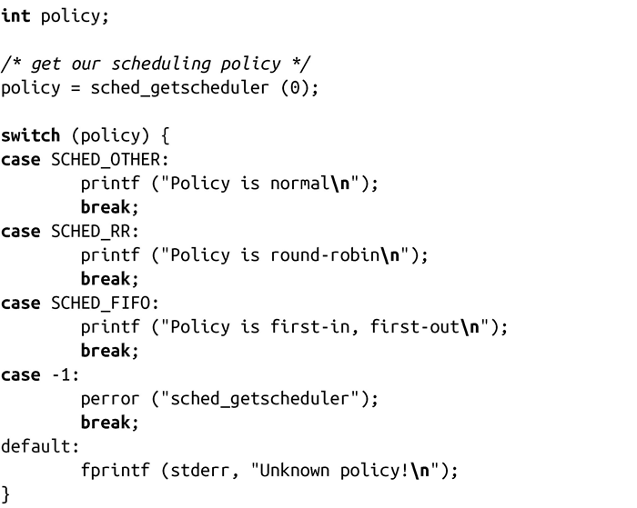
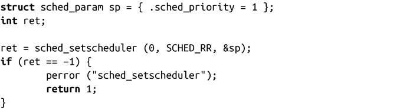

### 6.6.4　Linux调度策略和优先级

Linux对进程的调度行为依赖于进程的调度策略，也称为调度类别（scheduling class）。除了正常的默认策略，Linux还提供了两种实时调度策略。头文件<sched.h>中的预处理器宏表示各个策略：分别是SCHED_FIFO、SCHED_RR和SCHED_ OTHER。

每个进程都持有一个静态优先级，该优先级和nice value无关。对于普通应用，静态优先级的值为0；对于实时应用，其值为1到99。Linux调度器总是选择优先级最高的进程运行（即静态优先级值最大的进程）。如果一个正在运行的进程，其优先级值为50，当优先级为51的进程就绪时，调度器会立即直接抢占当前进程，转而运行新的高优先级进程。相反地，如果一个优先级为49的进程就绪，它会一直等待，直到优先级为50的进程阻塞才可运行。因为普通进程的优先级是0，所以任何就绪的实时进程总会抢占非实时进程，开始运行。

#### “先进先出”策略

先进先出（FIFO）策略是没有时间片、非常简单的实时策略。只要没有更高优先级进程就绪，FIFO类型的进程就会持续运行，用宏SCHED_FIFO表示。

由于缺少时间片，它的操作策略相当简单：

+ 如果一个就绪的FIFO类型的进程是系统中的最高优先级进程，它就会一直保持运行。特别地，当FIFO类型的进程就绪时，它就会立即抢占普通进程。
+ FIFO类型的进程会持续运行，直到阻塞或者调用sched_yield()，或者有个更高优先级的进程就绪。
+ 当FIFO类型的进程阻塞时，调度器会将其移出就绪队列。当该进程重新就绪时，会被插到相同优先级的进程队列末尾。因此，它必须等待更高优先级或同等优先级的进程停止运行后，才会运行。
+ 当FIFO类型的进程调用sched_yield()时，调度器会把它放到同等优先级的进程队列末尾，因此，它必须等待其他同等优先级的进程停止运行后，才会运行。如果不存在和调用进程相同优先级的进程，调用sched_yield()就没有用。
+ 当FIFO类型的进程被抢占，它在优先级队列中的位置不变。因此，一旦高优先级进程停止运行，被抢占的FIFO类型的进程就会继续运行。
+ 当一个进程成为FIFO类型的进程，或者该进程的静态优先级发生变化，它就会被放到相应优先级的进程队列队首。因此，新来的FIFO类型的进程会抢占同等优先级的进程。

实质上，只要FIFO类型的进程在系统中的优先级最高，我们可以认为它就能一直运行。比较有趣的部分在于同等优先级的FIFO进程之间的关系。

#### 轮询策略

轮询（round-robin，RR）策略和FIFO策略类似，区别在于对于处理相同优先级的进程，轮询策略还额外指定了一些其他规则。轮询策略以SCHED_RR表示。

调度器会给每个轮询类型的进程分配一个时间片。当轮询类型的进程耗光时间片时，调度器会把该进程放到其所在优先级队列的末尾。通过这种方式，轮询类型的进程间就能轮询调度。如果给定优先级队列里只有一个进程，轮询类型就等同于FIFO类型，在这种情况下，当进程消耗完当前时间片，会立即继续执行。

我们可以认为轮询类型的进程等同于FIFO型进程，只不过轮询类型的进程会是在时间片耗尽的时候停止运行，排到同等优先级队列的末尾。

决定选择SCHED_FIFO还是SCHED_RR完全取决于内部优先级的操作，轮询类型的进程的时间片仅在相同优先级的进程间相关。FIFO类型的进程还是会继续运行，轮询类型的进程会在某个相同优先级的进程间调度，但是都不会出现高优先级进程等待低优先级进程的情况。

#### 普通调度策略

SCHED_OTHER代表标准调度策略，是非实时进程的默认调度策略。所有普通类型的进程的静态优先级都为0，因此，任何一个就绪的FIFO或轮询类型的进程都会抢占它们。

调度器利用先前讨论过的nice value来划分普通进程的优先级，静态优先级不受nice value的影响，始终为0。

#### 批调度策略

SCHED_BATCH是批调度或空闲调度策略，它在某种程度上是实时调度的对立面：这种类型的进程只在系统中没有其他就绪进程时才会运行，即使那些进程已经耗光时间片。这不同于低优先级进程（即nice value值最大），在那种情况下，进程最终会在高优先级进程耗光时间片后开始运行。

#### 设置Linux调度策略

进程可以通过sched_getscheduler()和sched_setscheduler()来操作Linux调度策略：

成功调用sched_getscheduler()会返回由pid指定的进程的调度策略。如果pid值为0，则返回调用进程的调度策略。<sched.h>中定义了一个整数，表示调度策略：SCHED_FIFO表示先进先出策略，SCHED_RR表示轮询策略，SCHED_OTHER表示普通策略。出错时，函数值返回-1（-1不是合法的调度策略），同时相应地设置errno值。

sched_getscheduler()的用法很简单：

调用sched_setscheduler()将设置由pid指定进程的调度策略。和策略相关的其他参数则是通过sp设置。当pid值为0时，进程将设置自己的策略和参数。成功时，函数返回0；失败时，返回-1并设置errno值。

sched_param结构体中的有效字段依赖于操作系统支持的调度策略。SCHED_RR和SCHED_FIFO都至少需要一个字段sched_priority来指明静态优先级。SCHED_OTHER不使用任何字段，虽然未来的调度策略可能会用到。因此，可移植的合法程序不应该对sched_param结构体的字段做出任何假定判断。

设置进程调度策略和参数很简单：

这个代码片段会设置调用进程采用轮询调度策略，其静态优先级值为1。我们假定1是个有效的优先级值——从技术角度看，并不需要这么做。我们会在下一节讨论如何得到有效优先级的取值范围。

设置非SCHED_OTHER的调度策略需要CAP_SYS_NICE权限，因此，通常由root用户运行实时进程。从2.6.12内核开始，RLIMIT_RTPRIO资源限制允许非root用户在一定上限内设置实时优先级。

出错时，errno值可能为以下四种错误值之一：

EFAULT 指针sp指向的内存区域非法或不可访问。

EINVAL policy指定的调度策略无效，或者sp值不适用于给定的策略（仅适用于sched_setscheduler()）。

EPERM调用进程没有相应权限来执行。

ESRCH pid指定的进程不存在。

