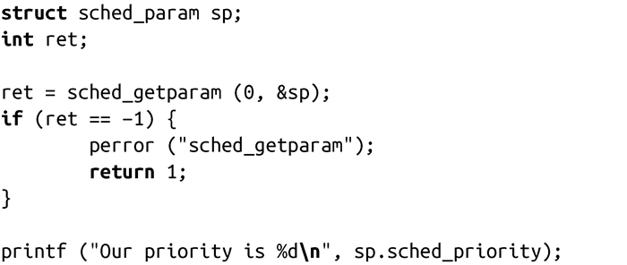
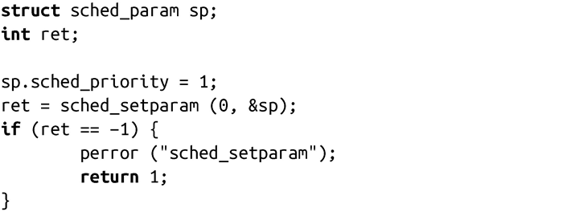
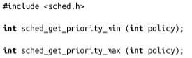
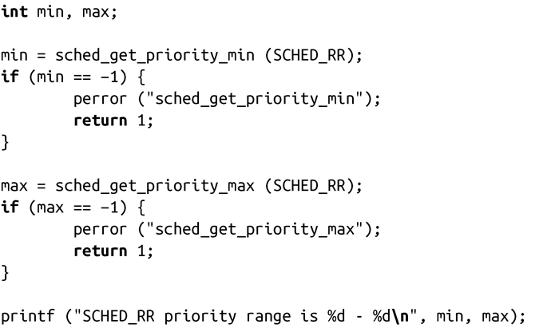
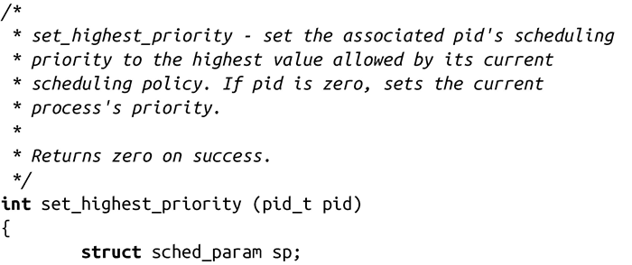
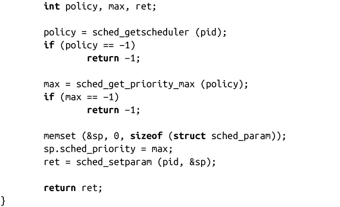

### 6.6.5　设置调度参数

POSIX定义的sched_getparam()和sched_setparam()接口可以获取并设置和已有调度策略相关的参数：

sched_getscheduler()接口只返回调度策略，不含任何相关的参数。sched_getparam()调用则将pid进程相关的调度参数存储在sp中：

如果pid值为0，sched_getparam()调用会返回调用进程的参数。成功时，调用会返回0，出错时，返回-1，并相应设置errno值。

因为sched_setscheduler()还设置了所有相关的调度参数，所以只有在后期要修改参数时，sched_setparam()才有用：

成功时，函数会根据sp设置pid指定进程的调度参数，并返回0。失败时，返回-1，并相应设置errno值。

如果以反序运行上面的两个代码片段，可以看到如下输出：

这个例子还是假设1是有效的优先级值。它确实是，但可移植的程序应该先判断一下。稍后我们将查看如何检测有效优先级的范围。

#### 错误码

出错时，errno值可能为以下四个值之一：

EFAULT 指针sp指向的内存区域非法或不可访问。

EINVAL sp值不适用于给定的策略（仅适用于sched_getparam()）。

EPERM 调用进程没有足够的权限。

ESRCH pid指定的进程不存在。

#### 确定有效优先级的范围

在前一个例子中，我们把硬编码的优先级数值传递给函数调用。POSIX并不保证系统上的调度优先级为固定值，只要求至少有32个不同的优先级。在6.6.4节中，我们曾提到Linux为两种实时调度策略提供了从1到99共99级的优先级策略。一个清晰、可移植的程序通常会实现自己的优先级范围，然后映射到操作系统的范围上。比如，如果你希望以四个不同的实时优先级来运行程序，可以动态地确定优先级范围，再从中选择四个值。

Linux提供两个系统调用来获得有效的优先级范围，一个返回最小优先级，另一个返回最大优先级：

成功时，sched_get_priority_min()会返回最小值，sched_get_priority_max()返回policy所关联的调度策略的最大有效优先级。失败时，这两个调用都返回-1。唯一可能的错误是policy值非法，在这种情况下，errno值会被设置为 EINVAL。

这两个函数调用的用法很简单：

在标准Linux系统上，运行以上代码片段会得到如下输出：

正如前面所讨论的，数值越大意味着优先级越高。要把进程设置成相应策略的最高优先级，可以通过如下代码实现：

程序一般都是获取系统的最小优先级或最大优先级，然后按1递增（比如max-1, max-2等），给指定进程分配优先级。

