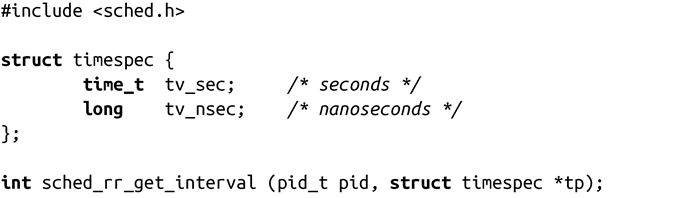
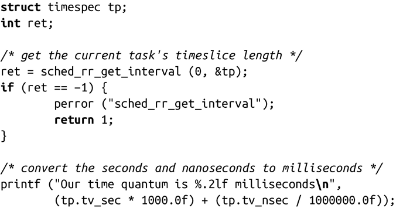

### 6.6.6　sched_rr_get_interval()

正如前面所提到的，除了拥有时间片外，SCHED_RR进程（即轮询）和SCHED_FIFO进程（即先进先出）相同。当SCHED_RR进程消耗完时间片时，调度器会把它放到同一优先级的进程队列队尾。通过这种方式，所有相同优先级的SCHED_RR进程循环运行。无论正在运行的进程时间片是否用完，高优先级的进程（包括同等或较高优先级的SCHED_FIFO进程）总是会抢占它。

POSIX定义了一个接口，可以获得指定进程的时间片长度：

sched_rr_get_interval()这个函数命名很糟糕，调用成功时，将把pid指定进程的时间片存储在tp指向的timespec结构中，并返回0；失败时，函数返回-1，并相应设置errno值。

POSIX规定sched_rr_get_interval()函数只适用于SCHED_RR进程，然而在Linux上，该函数可以获得任意进程的时间片长度。可移植的应用应该假定该函数仅适用于轮询策略，而只运行在Linux上的程序可以根据需要灵活使用该调用。该函数的调用例子如下：

如果进程是FIFO类型，则tv_sec和tv_nsec都是0，表示时间片无限长。

#### 错误码

出错时，errno值可能是三种值之一：

EFAULT 指针tp指向的内存非法或不可访问。

EINVAL pid值非法（比如pid是负值）。

ESRCH pid值合法，但指向的进程不存在。

