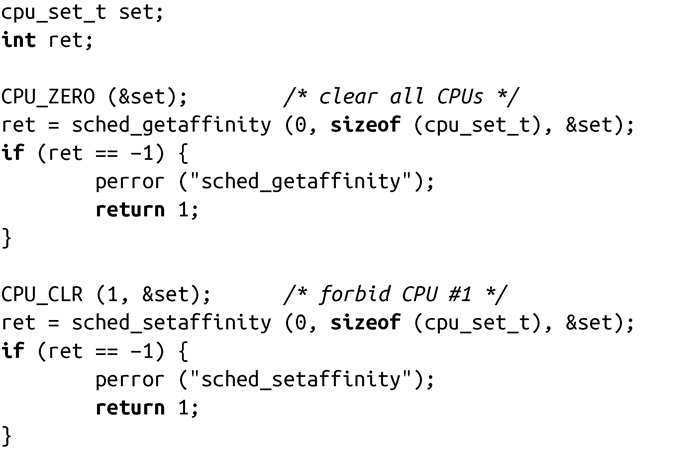
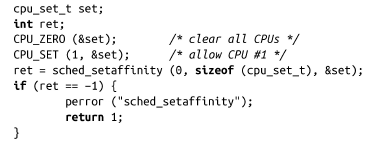

### 6.6.8　确定性

实时进程期望产生确定性的结果。在实时计算中，如果给予相同的输入，一个动作总是在相同的时间内产生相同的结果，我们就说这个动作是“确定性的（deterministic）”。现代计算机可以说是一些不确定性的集合体：多级缓存（命中与否不可预测），多处理器，分页，交换以及多任务这些因素都使估计一个动作需要执行多长时间变得不可能。当然，我们现在的每个动作（相对于硬盘访问而言）都“快得不可思议”，但同时现代系统也使得我们难于精确测量每一个动作的时间。

实时应用往往会对不可预测性以及最坏情况下的延迟有特殊限制。以下章节将讨论实现这一目标的两种方法。

#### 数据故障预测和内存锁定

想象一下以下场景：当洲际导弹系统ICBM监测碰撞的监视器接入产生硬件中断时，设备驱动迅速拷贝硬件数据到内核。驱动器发现有个进程因等待数据，阻塞在硬件设备上而进入睡眠状态。驱动器会通知内核唤醒该进程。内核注意到该进程是实时进程且拥有高优先级，就会直接抢占当前运行进程，直接切换成调度该实时进程。调度器也切换成运行实时进程，上下文切换到相应的地址空间。该实时进程又开始继续运行，整个过程耗时0.3ms，而最大延迟限度是1ms。

现在，我们来看看用户空间的情况。当实时进程接入洲际导弹系统时，开始处理轨道。当计算好弹道后，实时进程开始配置反导系统。这个过程仅仅耗时0.1ms，足够部署反弹道导弹响应和拯救生命。但实际上并非如此！因为反弹道导弹代码已经被交换到硬盘上，于是会发生页错误，处理器切换回内核模式，内核启动硬盘I/O来获取交换出去的数据。该实时进程会一直休眠，直到解决了页错误问题。这样，几秒钟就过去了，一切都太晚了。

显然，分页和交换给实时进程带来了很多不确定性，可能会带来灾难。为了阻止这种灾难，实时应用往往会通过“锁定”或“硬连接”的方式，把地址空间中的页提前放入物理内存，阻止其被交换出去。一旦页被锁定，内核就不会将其交换出去，对锁定页的任何访问都不会引起页错误，大多数实时应用都会锁定部分和全部页面到物理内存。

Linux为故障预测和锁定数据都提供了接口。第4章讨论了故障预测，把数据预先读入内存的接口，第8章将讨论锁定数据到物理内存的接口。

#### CPU亲和力和实时进程

实时应用的第二个难点在于多任务。虽然Linux内核是抢占式的，但是调度器并不总能直接调度另一个进程。有时，当前进程运行在内核中的临界区，调度器就必须等待该进程退出临界区，如果此时有一个实时进程要运行，延迟就会变得不可接受，很快就会超出操作时限。

同样，多任务和分页一样也带来了类似的不确定性。对于多任务，其解决方案也差不多：消除它。当然，前提是你不能简单地消灭所有其他进程，如果可以的话，可能根本就不需要Linux了——一个简单的、定制的操作系统就能满足要求。如果系统中有多个处理器，可以指定一个或多个专门用于处理实时进程。实际上，可以把实时进程从多任务中分离开来。

本章前面已经讨论过用于操作进程CPU亲和力的系统调用。对实时进程的潜在优化方式是为每个实时进程保留一个处理器，剩下的处理器由其他进程共享。

要实现这一点，最简单的方式是修改Linux的init程序，SysVinit<a class="my_markdown" href="['#anchor62']">[2]</a>，从而可以在启动进程前完成类似下面的操作：

这个代码片段首先得到初始的当前可用处理器集合，我们期望是所有处理器集合。然后，从集合中划出一个处理器CPU #1，更新可用处理器集合。

因为子进程会继承父进程的可用处理器集合，而init又是所有进程的祖先，所以所有的进程都会根据修改后的处理器集合运行，CPU #1上将不运行任何进程。

接下来，修改实时程序，使它只在CPU #1上运行：

因此，结果是实时进程只运行在CPU #1上，所有其他的进程分享剩下的处理器。

