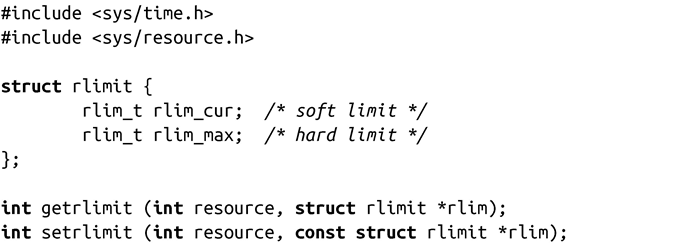

### 6.7　资源限制

Linux内核对进程有资源限制，明确规定了进程可以消耗的内核资源的上限，比如打开文件的数目，内存页数，未处理的信号等。这些限制是强制性的，内核不会允许进程的资源消耗超过这一硬性限制。比如，如果一个打开文件的操作会使得进程拥有的文件超出资源限制，open()调用会失败<a class="my_markdown" href="['#anchor63']">[3]</a>。

Linux提供了两个操作资源限制的系统调用。这两个都是标准的POSIX调用，而且Linux还做了一些补充，可以分别调用getlimit()和setlimit()来获取和设置限制：

一般用类似RLIMIT_CPU的整数常量表示资源，rlimit结构表示实际限制，该结构定义了两个上限：软限制和硬限制。内核对进程采取软限制，但进程自身可以修改软限制，设置成0到硬限制之间的任意值。不具备CAP_SYS_RESOURCE权限的进程（比如，非root进程），只能调低硬限制。非特权进程不能提升其硬限制，甚至不能恢复成之前的较高的值，因此，调低硬限制的操作是不可逆的。特权进程则可以把硬限制设置为任意合法值。

限制的真正含义与资源相关。比如资源的上限RLIMIT_FSIZE，就表示一个进程可以创建的最大文件长度是RLIMIT_FSIZE个字节。因此，如果rlim_cur是1 024，则表示进程不可以创建大于1KB的文件，也不能扩展文件至1KB以上。

所有的资源限制都有两个特殊值：0和无限制（infinity）。前者表示禁止使用资源，例如如果RLIMIT_CORE是0，则表示内核不会创建内存转储文件。相反，后者表示不存在对资源的限制。内核用特殊值RLIM_INFINITY表示无限，该值用-1表示（可能会和函数调用错误返回-1值相混淆）。如果RLIMIT_CORE是无限制，则内核可以创建任意大小的core文件。

函数getrlimit()会在指针rlim指向的结构中存储参数resource所指向资源的软硬限制。成功时，返回0；出错时，返回-1，并设置相应的errno值。

因此，函数setrlimit()会按rlim指定的值设置参数resource所指向资源的软硬限制。成功时，返回0，内核更新对应的资源限制；失败时，返回-1，并相应设置errno值。

