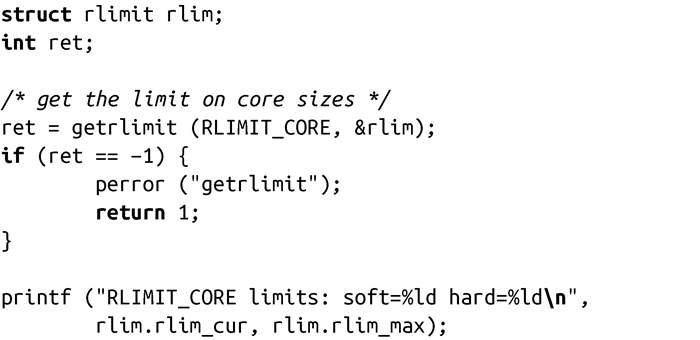
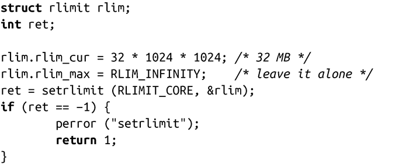

### 6.7.2　获取和设置资源限制

前面已经阐述了各种资源限制，现在让我们来考察一下如何获取和设置这些限制。获取资源限制的方法很简单：

编译包含该代码段的程序，运行时该代码段会输出以下结果：

可以看到，软限制设置为0，硬限制设置为-1（-1代表没有限制）。因此我们可以设置软连接为任意值。下面的例子设置core文件最大为32MB：

#### 错误码

出错时，errno可能有三种值：

EFAULT

rlim指向的内存非法或不可访问。

EINVAL

resource值非法，或者rlim.rlim_cur值大于rlim.rlim_max值（仅适用于setrlimit()）。

EPERM

调用者要提升硬限制，但没有CAP_SYS_RESOURCE权限。

<a class="my_markdown" href="['#ac61']">[1]</a> util-linux 包可以从kernel.org中获取，授权方式是GNU General Public Licence v2。

<a class="my_markdown" href="['#ac62']">[2]</a> 注：SysVinit源代码可以在ftp://ftp.cistron.nl/pub/people/miquels/sysvinit/获取，其授权方式是GNU General Public License v2。

<a class="my_markdown" href="['#ac63']">[3]</a> 注：此时，调用会设置错误号为EMFILE，表明进程达到文件数量上限。第 2章讨论了open()系统调用。

