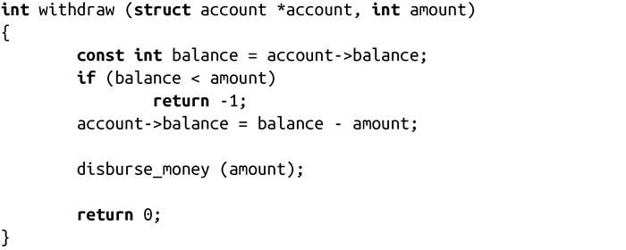
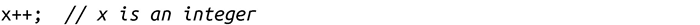

### 竞争

并发性给线程编程带来了很多挑战。由于支持重叠执行（overlapping execution），线程以不可预测的顺序执行。在某些情况下，这不会带来问题。但是，如果线程间需要共享资源，怎么办呢？即使只是访问内存中的一个单词都会造成“竞争”，程序由于不确定哪个线程先执行而带来行为不一致。

一般而言，竞争条件是指由两个或多个线程对共享资源的非同步访问而导致错误的程序行为。共享资源可以是以下任意一种：系统硬件、内核资源或内存中的数据。后者是最常见的，称为数据竞争（data race）。竞争所发生的窗口——需要同步的代码区——称为“临界区”。竞争可以通过对临界区的同步线程访问来消除。在深入探讨同步机制之前，我们先来探讨一些条件竞争的例子。

#### 现实世界中的竞争场景

假设有个自动取款机（ATM）。使用方式很简单：来到取款机前，刷卡，输入个人识别码（PIN），然后输入要提取的金额。然后，把钱取走。在这个过程中，银行需要验证你的账户是否有足够金额，如果有，则从你的账户中减去要提取的金额。算法看起来如下。

1．账户是否有足够X金额？

2．如果有，从账户余额中减去X，把X金额弹出给用户。

3．如果没有，返回错误。

C代码看起来如下：

这种执行方式会产生可怕的竞争问题。想象一下，如果银行并发执行两次该函数，会发生什么情况。可能客户正在取钱，同时银行在处理在线账单或评估异常账单。如果这两项账户余额检查发生在同一时刻，都发生在已经弹出取款金额，并在更新账户余额之前，结果会怎么样？会弹出两次金额，即使账户余额不够弹出两次！举个例子，假设账户中有500美元，两次取款请求分别是200美元和400美元，这两次取款请求都会成功，虽然这样会导致100美元坏账，当然，代码本身也不希望允许这种情况。

实际上，这个函数还存在另一个竞争问题。假设把更新的余额值保存到account字段中。两次取款对于更新账户余额也会存在竞争。在前面给出的例子中，最后保存的余额值可能是300美元或100美元。在这种情况下，银行不仅允许执行本不应该支持的两次取款操作，而且还可能会导致给客户余额额外400美元。

实际上，该函数每一行操作几乎都涉及临界区。如果这家银行要通过可行的商业模式生存下去，需要对withdraw()函数以同步方式来操作，确保即使有两个或多个线程并发执行，整个函数还是作为原子单元来执行：银行需要加载账户余额，检查可用的资源，并且把余额在一次不可分割的事务中记入借方。

在查看银行如何执行之前，先来考虑一个示例，它说明了竞争条件是多么基本的。银行取款示例实际是非常高层的：甚至我们都不需要给出示例代码。银行经理理解如果允许账户同时记账和借账，那计算就乱套了。竞争条件也都存在于最底层。

比如以下这段简单的代码：

该++操作符是个后增操作符，我们都知道它会执行什么操作：获取当前的x值，把x值加1，把加1后的新的值再保存到x中，该表达式的返回值即更新后的x值。该操作如何编译成机器码取决于架构，它看起来可能如下：

是的，x++也是个竞争条件。假设有两个线程并发执行x++，其中x=5。以下是期望的输出：

| 时　　间 | 线程1 | 线程2 |
| :-----  | :-----  | :-----  | :-----  | :-----  |
| 1 | 把x加载到寄存器（5） |
| 2 | 寄存器值加1（6） |
| 3 | 把寄存器值赋给x（6） |
| 4 |  | 把x加载到寄存器中（6） |
| 5 |  | 寄存器加1（7） |
| 6 |  | 把寄存器值赋给x（7） |

当然，下面这种情况也是期望的：

| 时　　间 | 线程1 | 线程2 |
| :-----  | :-----  | :-----  | :-----  | :-----  |
| 1 |  | 把x加载到寄存器（5） |
| 2 |  | 寄存器值加1（6） |
| 3 |  | 把寄存器值赋给x（6） |
| 4 | 把x加载到寄存器中（6） |
| 5 | 寄存器加1（7） |
| 6 | 把寄存器值赋给x（7） |

如果是以上两种执行方式之一，那是幸运的。但是，我们还是无法避免下面这种情况：

| 时　　间 | 线程1 | 线程2 |
| :-----  | :-----  | :-----  | :-----  | :-----  |
| 1 | 把x加载到寄存器（5） |
| 2 | 寄存器值加1（6） |
| 3 |  | 把x加载到寄存器中（5） |
| 4 | 把寄存器值赋给x（6） |
| 5 |  | 寄存器加1（6） |
| 6 |  | 把寄存器值赋给x（6） |

很多其他组合也会带来不期望的结果。这些示例说明了并发性，而不是并行性。有了并行性，线程可以同时执行，就会带来更多的潜在错误：

| 时　　间 | 线程1 | 线程2 |
| :-----  | :-----  | :-----  | :-----  | :-----  |
| 1 | 把x加载到寄存器（5） | 把x加载到寄存器（5） |
| 2 | 寄存器值加1（6） | 寄存器值加1（6） |
| 3 | 把寄存器值赋给x（6） | 把寄存器值赋给x（6） |

现在，你可能已经明白了。即使是对于给变量加1的操作——一行C或C++代码，一旦有多个线程并发执行，都会充满竞争条件。我们甚至不需要并行性。一台处理器就可以——而且可能会遇到这些竞争问题。条件竞争是程序员挫折感和程序bug的最大来源。我们一起来看看程序员是如何处理这些问题的。

