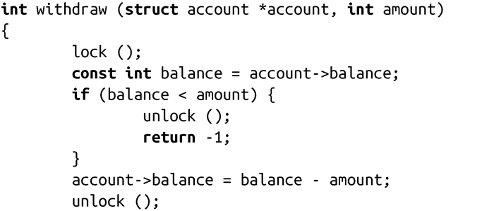
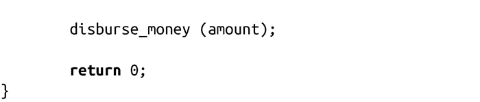
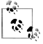

### 7.6.1　互斥

实现临界区原子性访问的技术有很多种：从单一指令解决方案到大块的代码段。最常见的技术是锁（lock），锁机制可以保证临界区的互斥，使得对临界区的操作具备原子性。由于锁支持互斥，在Pthreads（以及其他地方）中称之为“互斥（mutexes）”。

计算机的“锁”和现实世界的锁的工作机制类似：假设房间是个临界区。如果没有锁，人们（线程）就可以在房间里（临界区）随意来来去去。在特定情况下，同一时刻房间里可以有多个人。因此，我们给房间安上门并锁上门。我们给这扇门发个钥匙。当有人（线程）来到门前时，他们发现钥匙在外面，就拿钥匙开门，进到房间里，然后从里面锁上门。不会再有其他人进来。他们可以在房间内做自己的事情，而不会被打扰。没有其他人会同时占用该房间，它是个互斥的资源。当这个人不需要房间时，打开门出去，把钥匙留在外面。可能会有下一个人进来，并锁上门，这样不断重复。

锁在线程机制下的工作方式很类似。程序员定义锁，并确保在进入临界区之前获取该锁。锁的实现机制确保一次只能持有一个锁。如果有另一个线程使用锁，新的线程在继续之前必须等待。如果不再在临界区，就释放锁，让等待线程（如果有的话）持有锁并继续执行。

回想一下第7.5节中的银行取款的例子。我们一起来看下互斥是如何阻止一场灾难性的（至少对银行而言）条件竞争。稍后，我们将探讨实际的互斥操作（参见7.7.9节），但是现在我们先假定通过函数lock()和unlock()分别获取和释放互斥。

我们只对会产生竞争的那部分代码加锁：读取账户余额，检查资金是否足够，以及更新账户余额。一旦程序判定交易有效，并更新账户余额，就可以删除锁，弹出钱，之后不再执行互斥操作。临界区越小越好，因为锁阻止并发，因而会抵消线程带来的好处。

注意，锁本身并没有什么神秘之处。物理上并不会强制互斥操作。锁遵循“绅士原则”。所有线程必须获取正确的锁。只要认真编程，没有什么可以阻止线程获取真正的锁。

>  **锁住数据，而不是代码**
> 多线程编程中最重要的编程模式之一是“锁住数据，而不是代码”。虽然我们已经探讨了关于临界区的竞争条件，好的程序员不会把代码作为锁对象。你永远不会说“通过锁保护这个函数”。相反，好的程序员会把数据和锁关联起来。共享数据持有关联锁，访问这部分数据需要持有关联的锁。
> 区别在哪里呢？当你把锁和代码关联起来时，锁的语义就很难理解。随着时间变化，锁和数据之间的关系就不会很清晰，程序员会为数据引入新的使用方式，而不会包含相应的锁。把锁和数据关联，这个映射就会很清晰。

