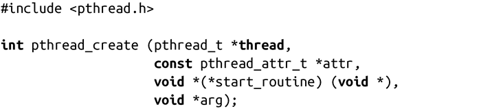
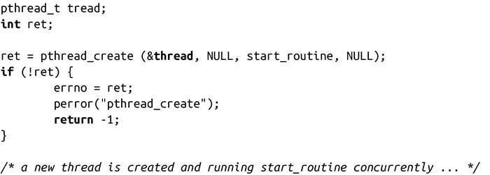

### 7.7.4　创建线程

当程序第一次运行并执行main()函数时，它是单线程。实际上，编译器支持一些线程安全选项，链接器把它连接到Pthreads库中，你的进程和其他进程没有什么区别。在初始化线程中，有时称为默认线程或主线程，必须创建一个或多个线程，才能实现多线程机制。

Pthreads提供了函数pthread_create()来定义和启动新的线程：

调用成功时，会创建新的线程，开始执行start_routine提供的函数，可以给该函数传递一个参数arg。函数会保存线程ID，用于表示新的线程，在由thread指向的pthread_t结构体中，如果不是NULL的话（我们将在7.7.5小节讨论线程ID）。

由attr指向的pthread_attr_t对象是用于改变新创建线程的默认线程属性。绝大多数pthread_create()调用会传递NULL给attr，采用默认属性。线程属性支持程序改变线程的各个方面，比如栈大小、调度参数以及初始分离（detach）状态。对线程属性的完整探讨超出了本章的范围，Pthread的man pages（帮助页面）是个很好的资源。

start_routine必须包含以下特征：

因此，线程执行函数，接收void指针作为参数，返回值也是个void指针。和fork()类似，新的线程会继承绝大多数属性、功能以及父线程的状态。和fork()不同的是，线程会共享父进程资源，而不是接收一份拷贝。当然，最重要的共享资源是进程地址空间，但是线程也共享（通过接收拷贝）信号处理函数和打开的文件。

使用该函数的代码应该传递-pthread给gcc。这适用于所有的Pthread函数，后面不会再提这一点。

出错时，pthread_create()会直接返回非零错误码（不使用errno），线程的内容是未定义的。可能的错误码包含：

EAGAIN

调用进程缺乏足够的资源来创建新的线程。通常这是由于进程触碰了某个用户或系统级的线程限制。

EINVAL

attr指向的pthread_attr_t对象包含无效属性。

EPERM

attr指向的pthread_attr_t对象包含调用进程没有权限操作的属性。

示例代码如下：

在我们介绍完足够多的的技术后，我们将查看一个完整的程序示例。

