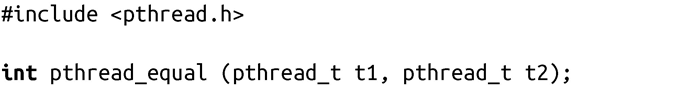
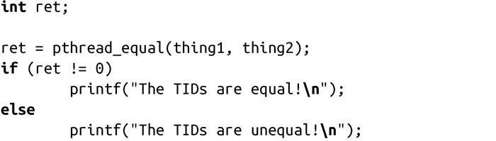

### 7.7.5　线程ID

线程ID（TID）类似于进程ID（PID）。但是，PID是由Linux内核分配的，而TID是由Pthread库分配的<a class="my_markdown" href="['#anchor72']">[2]</a>。TID是由模糊类型pthread_t表示的，POSIX不要求它是个算术类型。正如我们所看到的，新线程的TID是在成功调用pthread_create()时，通过thread参数提供。线程可以在运行时通过pthread_self()函数来获取自己的TID：

使用方式很简单，因为函数本身不会失败：

比较线程ID

因为Pthread标准不需要pthread_t是个算术类型，因此不能确保等号可以正常工作。因此，为了比较线程ID，Pthread库需要提供一些特定接口：

如果提供的两个线程ID一样，pthread_equal()函数会返回非零值。如果提供的线程ID不同，返回0。该函数不会失败。以下是个简单的示例：

