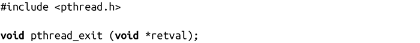
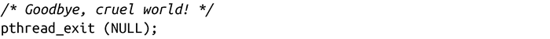
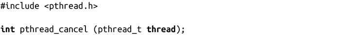
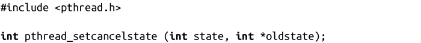
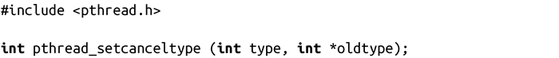
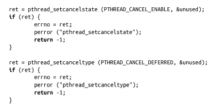
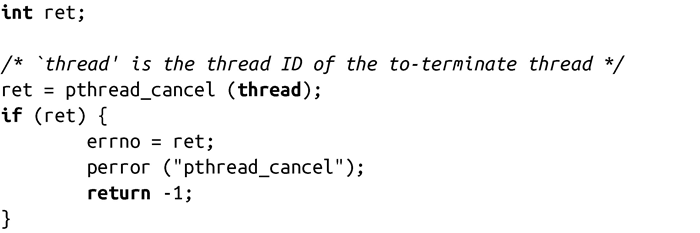

### 7.7.6　终止线程

和创建线程相对应的是终止线程。线程终止和进程终止很类似，差别在于当线程终止时，进程中的其他线程会继续执行。在一些线程模式中，比如“每个连接一个线程”（见7.4.1小节），线程会被频繁创建和销毁。

线程可能会在某些情况下终止，所有这些情况都和进程终止类似：

+ 如果线程在启动时返回，该线程就结束。这和main()函数结束有点类似。
+ 如果线程调用了pthread_exit()函数（后面会讨论），它就会终止。这和调用exit()返回类似。
+ 如果线程是被另一个线程通过pthread_cancel()函数取消，它就会终止。这和通过kill()发送SIGKILL信号类似。

这三个示例都只会杀死有问题的线程。在以下场景中，进程中的所有线程都被杀死，因此整个进程都被杀死：

+ 进程从main()函数中返回。
+ 进程通过exit()函数终止。
+ 进程通过execve()函数执行新的二进制镜像。

信号可以杀死一个进程或单个线程，这取决于如何发送。Pthreads使得信号处理变得非常复杂，在多线程程序中，最好最小化信号的使用方式。第10章给出了关于信号的详细描述。

#### 线程自杀

最简单的线程自杀方式是在启动时就结束掉。在通常情况下，你可能想要结束函数调用栈中的某个线程，而不是在启动时。在这种情况下，Pthreads提供了pthread_exit()函数，该函数等价于exit()函数：

调用该函数时，调用线程会结束。retval是提供给需要等待结束线程的终止状态的线程（参见7.7.7小节），还是和exit()功能类似。不会出现出错情况。

使用方式：

#### 终止其他线程

线程通过其他线程终止来调用结束线程。它提供了pthread_cancel()函数来实现这一点：

成功调用pthread_cancel()会给由线程ID表示的线程发送取消请求。线程是否可以取消以及如何取消分别取决于取消状态和取消类型。成功时，pthread_cancel()会返回0。注意，返回成功只是表示成功执行取消请求。实际的取消操作是异步的。出错时，pthread_cancel()会返回ESRCH，表示thread是非法的。

线程是否可取消以及何时取消有些复杂。线程的取消状态只有“允许（enable）”和“不允许（disable）”两种。对于新的线程，默认是允许。如果线程不允许取消，请求会入队列，直到允许取消。在其他情况下，取消类型会声明什么时候取消请求。线程可以通过pthread_setcancelstate()来改变其状态：

成功时，调用线程的取消状态会被设置成state，老的状态保存到oldstate中<a class="my_markdown" href="['#anchor73']">[3]</a>。state值可以是PTHREAD_CANCEL_ENABLE或PTHREAD_CANCEL_DISABLE，分别表示支持取消和不支持取消。

出错时，pthread_setcancelstate()会返回EINVAL，表示state值无效。

线程的取消类型可以是异步的或延迟的（deferred），默认是后者。对于异步取消请求操作，当发出取消请求后，线程可能会在任何点被杀死。对于延迟的取消请求，线程只会在特定的取消点（cancellation points）被杀死，它是Pthread或C库，表示要终止调用方的安全点。异步取消操作只有在某些特定场景下才有用，因为它使得进程处于未知状态。举个例子，如果取消的线程是处于临界区的中央，会发生什么情况？对于合理的程序行为，异步取消操作只应该用于那些永远都不会使用共享资源的线程，而且只调用信号安全的函数（参见10.4.1节）。线程可以通过pthread_setcanceltype()改变状态：

成功时，调用线程的取消类型会设置成type，老的类型保存到oldtype中<a class="my_markdown" href="['#anchor74']">[4]</a>。type可以是PTHREAD_CANCEL_ASYNCHRONOUS或PTHREAD_CANCEL_ DEFERRED类型，分别使用异步或延迟的取消方式。

出错时，pthread_setcanceltype()会返回EINVAL，表示非法的type值。

下面我们来考虑一个线程终止另一个线程是示例。首先，要终止的线程支持取消，并把类型设置成deferred（这些是默认设置，因此以下只是个示例）：

然后，另一个线程发送取消请求：

