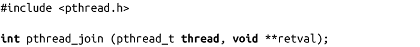
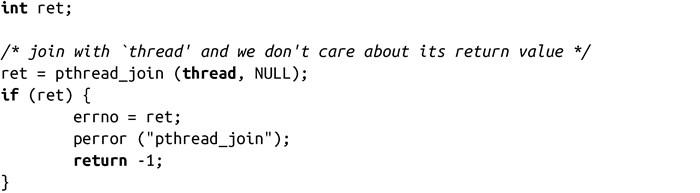
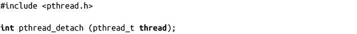

### 7.7.7　join（加入）线程和detach（分离）线程

由于线程创建和销毁很容易，必须有对线程进行同步的机制，避免被其他线程终止——对应的线程函数即wait()。实际上，即join（加入）线程。

#### join线程

join线程支持一个线程阻塞，等待另一个线程终止：

成功调用时，调用线程会被阻塞，直到由thread指定的线程终止（如果线程已经终止，pthread_join()会立即返回）。一旦线程终止，调用线程就会醒来，如果retval值不为NULL，被等待线程传递给pthread_exit()函数的值或其运行函数退出时的返回值会被放到retval中。通过这种方式，我们称线程已经被“joined”了。join线程支持线程和其他线程同步执行。Pthread中的所有线程都是对等节点，任何一个线程都可以join对方。一个线程join多个线程（实际上，正如我们所看到的，这往往是主线程等待其创建的线程的方式），但是应该只有一个线程尝试join某个特殊线程，多个线程不应该尝试随便join任何一个线程。

出错时，pthread_join()会返回以下非0错误码值之一：

EDEADLK

检测到死锁：线程已经等待join调用方，或者线程本身就是调用方。

EINVAL

由thread指定的线程不能join（参见下一节）。

ESRCH

由thread指定的线程是无效的。

使用示例：

#### detach线程

默认情况下，线程是创建成可join的。但是，线程也可以detach（分离），使得线程不可join。因为线程在被join之前占有的系统资源不会被释放，正如进程消耗系统资源那样，直到其父进程调用wait()，不想join的线程应该调用pthread_detach进行detach。

成功时，pthread_detach()会分离由thread指定的线程，并返回0。如果在一个已经分离的线程上调用pthread_detach()，结果会是未知的。出错时，函数返回ESRCH，表示thread值非法。

pthread_join()或pthread_detach()都应该在进程中的每个线程上调用，这样当线程终止时，也会释放系统资源。（当然，如果整个进程退出，所有的线程资源都会释放掉，但是显式加入或分离所有的线程是个良好的编码习惯。）

