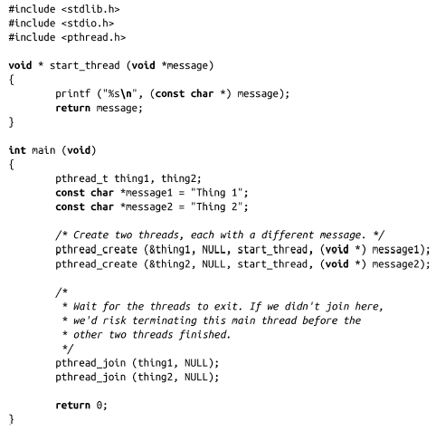

### 7.7.8　线程编码实例

以下完整的程序示例可以把目前讨论到的接口都串起来。它创建两个线程（共三个线程），使用相同的线程函数start_thread()启动这两个线程。通过提供不同的参数，这两个线程在启动行为上有区别。然后，把这两个线程都join到第三个线程中，如果join不成功，主线程会在其他线程之前退出，从而终止整个进程。

以上给出了完整的程序代码。如果把它保存成example.c，可以通过以下命令编译它：

然后，如下运行：

会生成如下结果：

或者如下结果：

但是都不会生成无意义的数据。为什么没有？因为printf()是个线程安全的函数。

