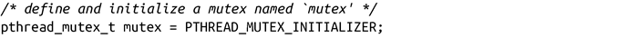
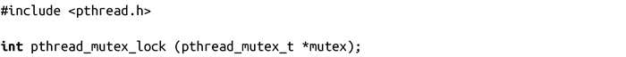
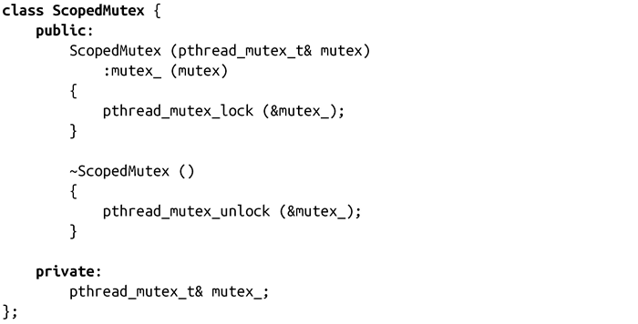
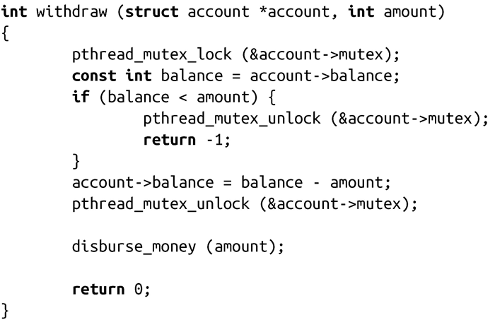

### 7.7.9　Pthread互斥

回顾7.6.1小节，确保相互排斥的最主要方法是互斥（mutex）。尽管互斥功能强大而且很重要，但实际上其使用是非常容易的。

#### 初始化互斥

互斥使用pthread_mutex_t对象表示。正如Pthread API中的绝大多数对象，它表示提供给各种互斥接口的模糊结构。虽然你可以动态创建互斥，绝大多数使用方式是静态的：

上面这段代码段定义和初始化了一个互斥体mutex。在使用互斥之前，需要做只有这么多。

#### 对互斥加锁

锁（也称为获取）Pthread互斥是通过pthread_mutex_lock()函数实现的：

成功调用pthread_mutex_lock()会阻塞调用的线程，直到由mutex指向的互斥体变得可用。一旦互斥体可用了，调用线程就会被唤醒，函数返回0。如果在调用时互斥体可用，函数会立即返回。

出错时，函数可能返回的非0错误码如下：

EDEADLK

调用线程已经持有请求的互斥体。默认情况下，不会有错误码，尝试获取已经持有的互斥体会导致死锁（参见7.6.2节）。

EINVAL

由mutex指向的互斥体是非法的。

调用方往往不会检查返回值，因为编码风格良好的代码不应该在运行时生成错误信息。一种使用方式如下：

#### 对互斥解锁

加锁的反面就是解锁，或者称释放互斥体。

成功调用pthread_mutex_unlock()会释放由mutex所指向的互斥体，并返回0。该调用不会阻塞，互斥可以立即释放。

出错时，函数返回非0的错误码，可能的错误码如下：

EINVAL

由mutex指向的互斥体是无效的。

EPERM

调用进程没有持有由mutex指向的互斥。该错误码是不确定的，如果尝试释放一个没有持有的互斥会产生bug。

对于解锁，用户也一般不会检查返回值：

**Scoped锁**

资源获取即初始化（RAII）是C++的一种编程模式——它是C++语言最强大的模式之一。RAII通过把资源的生命周期绑定到一个scoped对象的生命周期上，高效地实现了资源分配和收回。虽然RAII本是为了处理异常抛出后的资源清理而设计的，它是管理资源的最强大的方式之一。举个例子，RAII支持创建一个“Scoped文件”对象，当创建对象时打开文件，当对象超出范围时自动关闭。同样，我们也可以创建一个“scoped锁”，在创建时获取锁，当超出作用域空间时，自动释放互斥体。

为了使用互斥，只需要调用ScopedMutex m(mutex)。当m超出作用域空间时，会自动释放锁。这使得函数比较松弛，错误处理更简单，而且可以随意使用goto语句。

#### Mutex示例

我们一起来看个简单的代码片段，它利用互斥来保证同步。回顾一下第7.5节中的“现实世界中的竞争场景”中的银行取款例子。我们虚构的银行面临严重的条件竞争问题，允许不应该支持的行为。通过Pthread互斥体，我们可以解决取款问题：

这个例子使用pthread_mutex_lock()来获取一个互斥体，然后通过pthread_mutex_ unlock()释放它。通过这种方式，有助于消除竞争条件，但是它引入了银行中单点竞争问题：一次只能有一个客户取款！这会带来很大性能瓶颈，对于一个规模很大的银行而言，这种方式非常失败。

因此，绝大多数对锁的使用都避免全局锁，而是把锁和某些数据结构的特定实例关联起来。这称为细粒度锁。它可以使得锁语义更复杂，尤其是对于死锁避免，但是它是利用现代计算机多核扩展的关键。

在这个例子中，不是定义全局锁，而是在account结构体内定义了一把锁，使得每个account实例都有自己的锁。由于临界区中的数据只在account结构体中，所以这种机制工作良好。通过只锁定借方账户，银行可以并行处理其他客户的取款操作。

