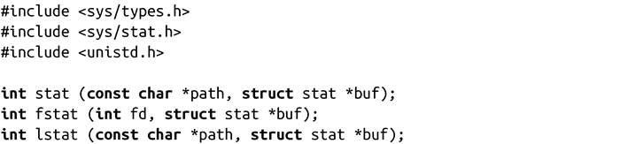
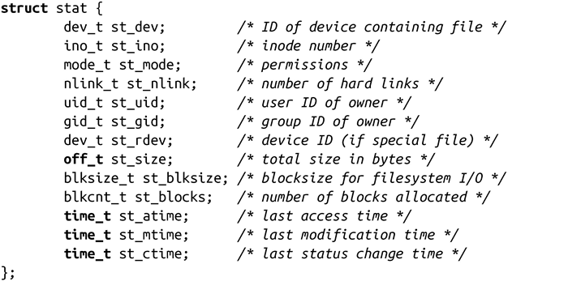
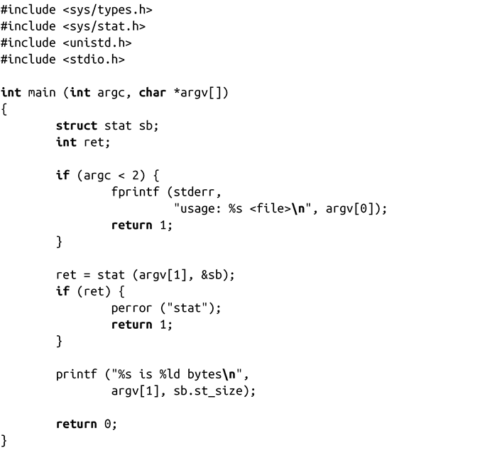
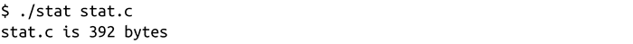
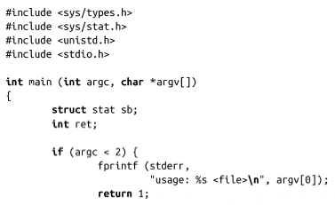
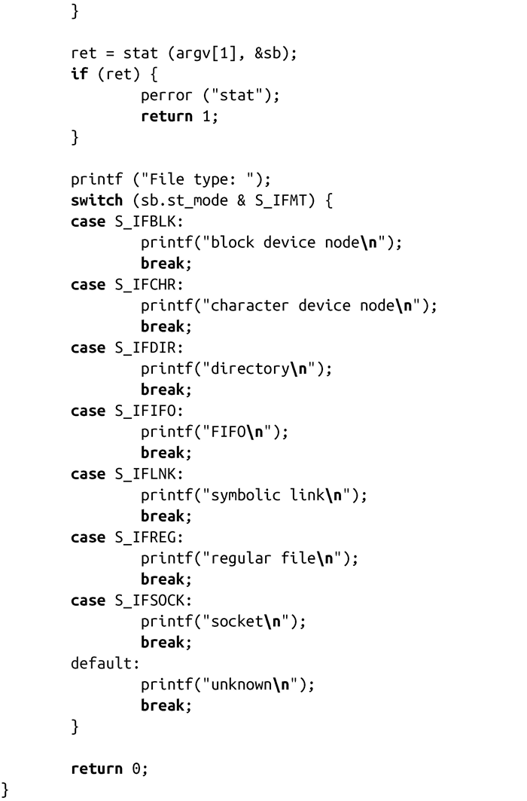
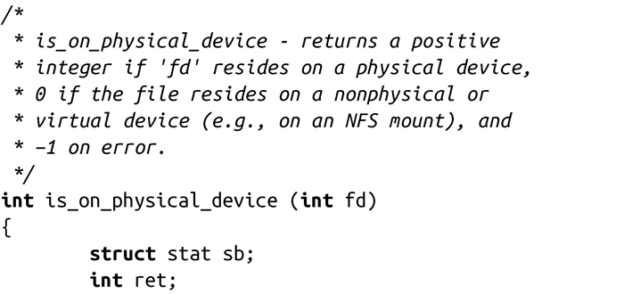
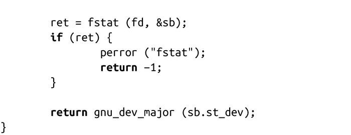

### 8.1.1　一组stat函数

UNIX提供了一组获取文件元数据的函数：

以上这些函数都返回文件的信息。stat()函数会返回由参数path所指定的文件信息，而fstat()返回由文件描述符fd所指向的文件信息。lstat()与stat()类似，唯一的区别是对于符号链接，lstat()返回的是链接本身而非目标文件。

以上这些函数都把用户提供的信息保存在stat结构体中。结构体stat是在<bits/stat.h>中定义的，但真正的定义是包含在<sys/stat.h>中：

以下是对结构体中各个字段的详细说明：

+ 字段st_dev描述了文件位于什么设备节点上（我们在本章稍后将讨论设备节点）。如果文件不在本地设备上——比如文件在网络文件系统(NFS)上——该值就为0。
+ 字段st_ino表示文件的inode编号。
+ 字段st_mode表示文件的权限字段。第1章和第2章已经讨论了各权限位和权限的内容。
+ 字段st_nlink表示指向文件的硬链接数。每个文件至少有一个硬链接。
+ 字段st_uid表示文件所有者的用户ID。
+ 字段st_gid表示文件的所属组ID。
+ 如果文件是设备节点，字段st_rdev描述了该设备节点信息。
+ 字段st_size提供了文件的字节数。
+ 字段st_blksize表示进行有效文件I/O的首选块大小。该值（或该值倍数）为用户缓冲I/O的最佳块大小（见第3章）。
+ 字段st_blocks表示分配给文件的块数目。当文件有“洞”时（也就是说该文件是一个稀疏文件）该值将小于st_size值。
+ 字段st_atime表示最新的文件访问时间，即最近一次文件被访问的时间（例如，通过read()或execle()）。
+ 字段st_mtime包含最新的文件修改时间——也就是说，最近一次文件被写入的时间。
+ 字段st_ctime包含最新的文件状态改变时间。该字段常被误解为文件创建时间，而在Linux或其他类UNIX系统中并不保存文件创建时间。该字段实际上描述的是文件的元数据（例如文件所有者或权限）最后一次被改变的时间。

成功时，三个调用都会返回0，并将文件元数据保存在stat结构体中。出错时，它们都返回-1，并相应设置errno值为以下值之一：

EACCES 调用的进程缺少对path指定的目录的某一部分的搜索权限（仅适用于stat()和lstat()）。

EBADF fd（仅适用于fstat()）非法。

EFAULT 参数path或buf指针非法。

ELOOP path包含太多的符号链接（仅适用于stat()和lstat()）。

ENAMETOOLONG 参数path太长（仅适用于stat()和lstat()）。

ENOENT 参数path中的某个目录或者文件不存在（仅适用于stat()和lstat()）。

ENOMEM 剩余内存不足，无法完成请求。

ENOTDIR 参数path指向的路径名不是目录（仅适用于stat()和lstat()）。

以下程序使用stat()来获取文件（文件在命令行参数中指定）的大小：

这是运行这段代码所在的程序的结果：

下面这个程序会给出程序的第一个参数所指向的文件的文件类型（如符号链接或块设备节点）：

最后，以下这个代码片段使用fstat()检查已经打开的文件是否在物理设备上（因为也可能在网络上）：

