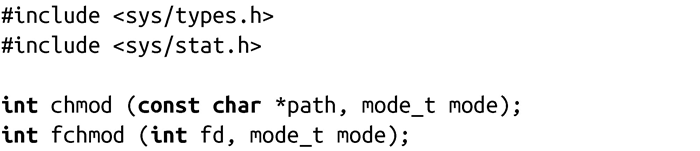
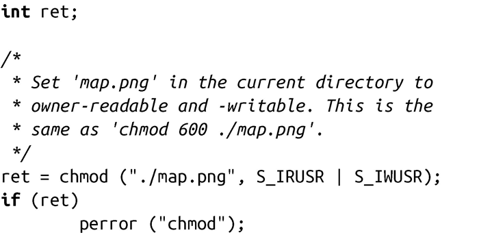
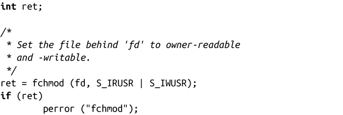

### 8.1.2　权限

虽然可以使用系统调用stat来获取指定文件的权限，但是可以使用下面两个系统调用来设置权限值：

chmod()和fchmod()都可以把文件权限设置为参数mode指定的值。对于chmod()方法，参数path表示需要修改的文件的相对或绝对路径名。对于fchmod()方法，文件是由文件描述符fd给定。

类型mode_t（该类型为整型）表示的是参数mode的合法值，和结构体stat中字段st_mode返回的值一样。虽然都是简单的整数值，对不同的UNIX实现而言，其含义都是不同的。所以，POSIX定义了各种代表权限的常量集（详见2.1.3节）。这些常量能执行二进制或运算，生成合法的mode值。例如，（S_IRUSR | S_IRGRP）会同时把文件拥有者和所属组的权限都设置为可读。

为了改变文件的权限，调用chmod()或fchmod()的进程有效ID必须匹配文件所有者，或者进程必须具有CAP_FOWNER权限。

成功时，chmod()和fchmod()都返回0；失败时，都返回-1，并相应设置errno值为下列值之一：

EACCES 调用的进程缺少对路径path中某一目录组成的搜索权限（仅适用于chmod()）。

EBADF文件描述符fd非法（仅适用于fchmod()）。

EFAULT path指针非法（仅适用于chmod()）。

EIO 文件系统发生内部I/O错误。这是遇到的很严重的错误，它表明损坏的磁盘或文件系统。

ELOOP 内核解析path时遇到太多符号链接（仅适用于chmod()）。

ENAMETOOLONG path太长（仅适用于chmod()）。

ENOENT path不存在（仅适用于chmod()）。

ENOMEM 剩余内存不足，无法完成请求。

ENOTDIR path路径中某部分不是目录（仅适用于chmod()）。

EPERM调用的进程有效ID与文件所有者不匹配，且进程缺少CAP_FOWNER权限。

EROFS文件位于只读文件系统上。

这段代码将文件map.png权限设置为所有者可读可写：

这段代码与上段代码功能一样，并假定用fd指向打开的文件map.png：

对所有现代UNIX系统而言，chmod()和fchmod()都是可用的。POSIX标准要求使用前者，而后者可选。

