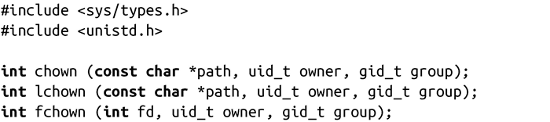
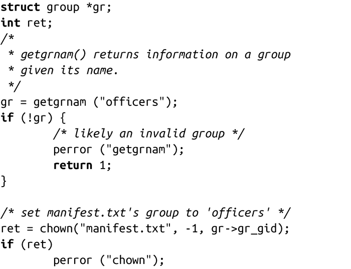
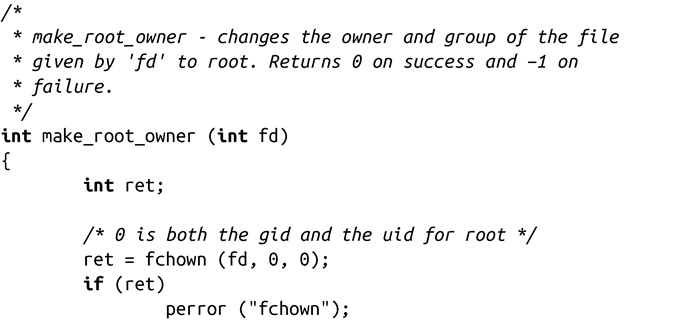

### 8.1.3　所有权

在stat结构中，字段st_uid和st_gid分别表示文件的所有者和所属群。以下三个系统调用允许用户改变这两个值：

chown()和lchown()设置由路径path指定的文件的所有权。它们的作用是相同的，除非文件是个符号链接：前者会获取符号链接所指向的目标文件，并改变链接目标而不是链接本身的所有权，而lchown()并不会获取符号链接所指向的目标文件，因此只改变符号链接的所有权。fchown()设置了文件描述符fd所指向的文件的所有权。

成功时，所有三个调用都会把文件所有者设置为owner，设置文件所属组为group，并返回0。如果字段owner或group的值为-1，说明值没有设定。只有具有CAP_CHOWN权限的进程（通常是root进程）才可以改变文件的所有者。文件所有者可以将文件所属组设置为任何用户所属组，具有CAP_CHOWN权限的进程可以把文件所属组修改为任何值。

失败时，调用均返回-1，并相应设置errno值为下列值之一：

EACCES 调用进程缺少对路径path中某一目录的搜索权限（仅适用于chown()和lchown()）。

EBADF fd非法（仅适用于fchown()）。

EFAULT path非法（仅适用于chown()和lchown()）。

EIO 发生内部I/O错误（这很严重）。

ELOOP 内核在解析path时遇到太多符号链接（仅适用于chown()和lchown()）。

ENAMETOOLONG path太长（仅适用于chown()和lchown()）)。

ENOENT 文件不存在。

ENOMEM 剩余内存不足，无法完成请求。

ENOTDIR 路径path中的某部分不是目录（仅适用于chown()和lchown()）。

EPERM 调用的进程缺少必要的权限，无法按要求改变所有者或所属组。

EROFS文件系统只可读。

这个代码片会把在当前工作目录下的manifest.txt文件的所属群修改为officers。为了实现这一点，调用的用户必须具备CAP_CHOWN权限或必须是用户kidd且在officers所属组中：

执行前，文件所属组是crew：

执行后，文件所属组被修改为officers：

文件的所有者kidd不会被改变，因为代码片段传递-1给uid。以下函数将fd指向的文件的所有者和所属组设置为root：

调用的进程必须具有CAP_CHOWN权限。如果进程具有CAP_CHOWN权限，往往意味着该进程的所有者是root。

