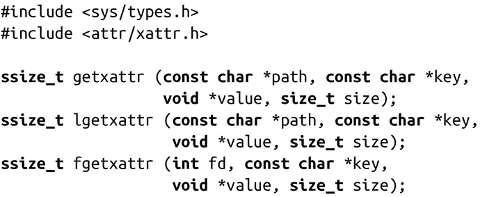
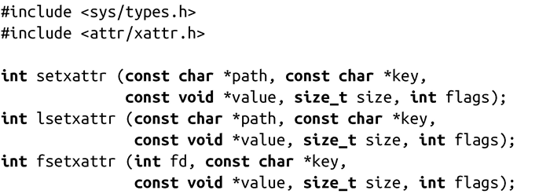
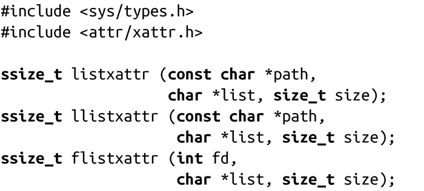
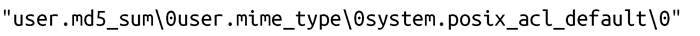
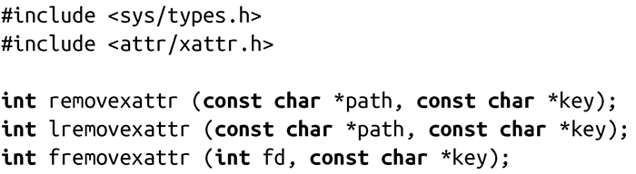

### 8.1.5　扩展属性操作

POSIX定义了应用程序可以对给定文件扩展属性执行的四种操作：

+ 给定文件，返回文件所有的扩展属性键的列表。
+ 给定文件和键，返回相应的值。
+ 给定文件，键与值，对键进行赋值。
+ 给定文件和键，从文件中删除对应的扩展属性。

对每个操作，POSIX提供三个系统调用：

+ 在给定路径名上执行操作的系统调用。如果路径指向符号链接，通常会在链接的目标文件上执行操作。
+ 在给定路径名上执行操作的系统调用。如果路径指向符号链接，也会在链接本身上执行操作（通常是以“l”开头的系统调用）。
+ 在文件描述符上执行操作的系统调用（一般为以“f”开头的系统调用）。

接下来，我们将讨论所有12种组合。

#### 返回扩展属性

最简单的操作是返回文件扩展属性给定键的值，如下：

getxattr()调用成功后，会将路径为path的文件中名字为key的扩展属性保存到缓冲区value中，该缓冲区的长度为size个字节。函数返回值为该值的实际大小。

如果size是0，调用会返回该值的大小，但不会把扩展属性保存到缓冲区value中。使用“0”，可以使应用程序确认存储键值的缓冲区的长度是否合适。获知大小后，应用程序会按需分配或调整缓冲区。

lgetxattr()与getxattr()行为一致。只是当路径为符号链接时，lgetxattr()返回的是链接本身而不是链接目标文件的扩展属性。大家回顾一下之前的讨论， 我们知道用户命名空间的属性不能被应用在符号链接上。因此，该调用很少被使用。

fgetxattr()在文件描述符fd上操作，其他方面，它的行为与getxattr()行为一致。

出错时，所有三个调用都返回-1，并相应设置errno值为下列值之一：

EACCES

调用的进程缺少对路径path中某一目录的搜索权限（仅适用于getxattr()和lgetxattr()）。

EBADF fd非法（仅适用于fgetxattr()）。

EFAULT path、key或value指针非法。

ELOOP路径path中包含太多符号链接（仅适用于getxattr()和lgetxattr()）)。

ENAMETOOLONG 路径path太长（仅适用于getxattr()和lgetxattr()）。

ENOATTR属性key不存在，或进程没有访问属性的权限。

ENOENT路径path中的某部分不存在（仅适用于getxattr()和lgetxattr()）。

ENOMEM剩余内存不足，无法完成请求。

ENOTDIR路径path中的某个部分不是目录（仅适用于getxattr()和lgetxattr()）。

ENOTSUP path或fd所在的文件系统不支持扩展属性。

ERANGE size太小，缓冲区无法保存键值。就像之前讨论的，调用可能将size设置为0，返回值将指明需要的缓存大小，并对value做适当的调整。

设置扩展属性

以下三个系统调用会设置给定的扩展属性：

setxattr()调用成功时，会设置文件path的扩展属性key为value，value的长度为size字节。字段flags修改调用的行为。如果flags是 XATTR_CREATE，当扩展属性已存在时调用将失败。如果flags是XATTR_REPLACE，当扩展属性不存在时，调用将返回失败。默认的行为（即当 flags值为0时执行）是同时允许创建和替换。不管flags值如何，除了key之外，对其他键都不会有影响。

lsetxattr()与setxattr()行为一致，只是当path是符号链接，它会设置链接本身而不是链接目标文件的扩展属性。回顾一下之前的讨论， 我们知道用户命名空间的属性不能被应用在符号链接上。因此，该调用很少被使用。

fsetxattr()在文件描述符fd上执行操作，其他方面，它与setxattr()行为一致。

成功时，所有三个系统调用都返回0；失败时，都返回-1，并相应设置errno值为以下值之一：

EACCES

调用的进程缺少对路径path中某一目录的搜索权限（仅适用于setxattr()和lsetxattr()）。

EBADF

fd非法（仅适用于fsetxattr()）。

EDQUOT

由于配额限制，阻止请求操作使用空间。

EEXIST

flags设置为XATTR_CREATE，且给定文件中的key已存在。

EFAULT

Path、key或value指针非法。

EINVAL

flags非法。

ELOOP

路径path中包含太多符号链接（仅适用于setxattr()和lsetxattr()）。

ENAMETOOLONG

路径path太长（仅适用于setxattr()和lsetxattr()）。

ENOATTR

flags设置为XATTR_REPLACE，且给定的文件中不存在key。

ENOENT

路径path中的某部分不存在（仅适用于setxattr()和lsetxattr()）。

ENOMEM

剩余内存不足，无法完成请求。

ENOSPC

文件系统剩余空间不足，无法存储扩展属性。

ENOTDIR

路径path中某部分不是目录（仅适用于setxattr()和lsetxattr()）。

ENOTSUP

path或fd所在的文件系统不支持扩展属性。

列出文件的扩展属性

以下三个系统调用会列出给定文件扩展属性集：

listxattr()调用成功时，会返回一个与路径path指定的文件相关联的扩展属性键列表。该列表存储在list指向的长度为size字节的缓冲区中。系统调用会返回列表的实际字节大小。

list中的每个扩展属性键是以'\0'结尾的，因此列表可能看起来如下：

因此，虽然每个键都是一个传统的、以'\0'结尾的C字符串，但是为了能够遍历整个键列表，还是需要整个列表的长度（可以从调用的返回值中获得该值）。为了确定所需缓冲区的大小，设置size为0并调用任意一个列表的函数，函数将返回整个键列表的实际长度。和调用getxattr()类似，应用程序可能使用这个功能来分配或调整缓冲区。

llistxattr()与listxattr()行为一致，只是当path为符号链接时，它会列出与链接本身而不是链接目标文件相关联的扩展属性。回顾一下之前的讨论，用户命名空间的属性不能被应用于符号链接——因此，该调用很少被使用。

flistxattr()对文件描述符fd进行操作，其他方面，它与listxattr()行为一致。

失败时，所有三个调用都返回-1，并相应设置errno值为以下值之一：

EACCES 调用的进程缺少对路径path中某一目录的搜索权限（仅适用于listxattr()和llistxattr()）。

EBADF fd非法（仅适用于flistxattr()）。

EFAULT path或list指针非法。

ELOOP 路径path中包含太多符号链接（仅适用于listxattr()和llistxattr()）。

ENAMETOOLONG path过长（仅适用于listxattr()和llistxattr()）。

ENOENT 路径path中的某个部分不存在（仅适用于listxattr()和llistxattr()）。

ENOMEM 剩余内存不足，无法完成请求。

ENOTDIR 路径path中某部分不是目录（仅适用于listxattr()和llistxattr()）。

ENOTSUPP path或fd所在的文件系统不支持扩展属性。

ERANGE size非零，且没足够大小存放整个键列表。应用程序可能设置size为0，调用后获得列表的实际大小。程序之后可能重置value，并重新调用该系统调用。

删除扩展属性

最后，以下3个系统调用可以从给定文件中删除指定键：

成功调用removexattr()会从文件path中删除扩展属性key。回顾之前讨论，未定义键与已定义但为空的键（零长度）有一定的区别。

lremovexattr()与removexattr()行为一致，除非path是符号链接，它会删除链接本身而不是链接目标文件的扩展属性。回顾之前，用户命名空间的属性不能被应用于符号链接，因此，该调用也很少被使用。

fremovexattr()操作文件描述符fd，其他方面，它与removexattr()行为一致。

成功时，所有3个系统调用返回0。失败时，所有3个调用返回-1，并相应设置errno值为下列值之一：

EACCES 调用的进程缺少对路径path中某一目录的搜索权限（仅适用于removexattr()和lremovexattr()）。

EBADF fd非法（仅适用于fremovexattr()）。

EFAULT path或key指针非法。

ELOOP路径path中包含太多符号链接。（仅适用于removexattr()和lremovexattr()）。

ENAMETOOLONG path太长（仅适用于removexattr()和lremovexattr()）。

ENOATTR给定文件不存在键key。

ENOENT路径path中的某部分不存在（仅适用于removexattr()和lremovexattr()）。

ENOMEM剩余内存不足，无法完成请求。

ENOTDIR路径path中的某部分不是目录（仅适用于removexattr()和lremovexattr()）。

ENOTSUPP path或fd所在的文件系统不支持扩展属性。

