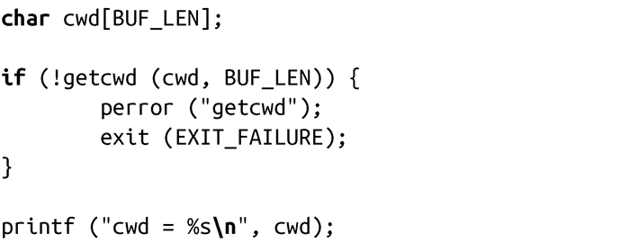
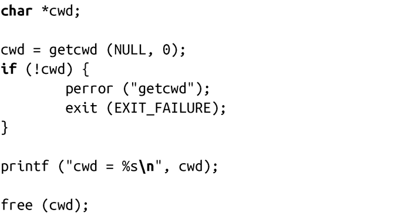
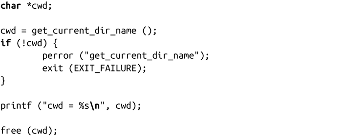
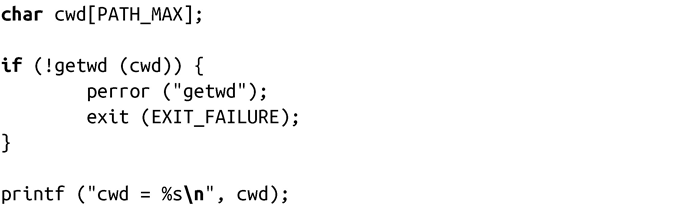
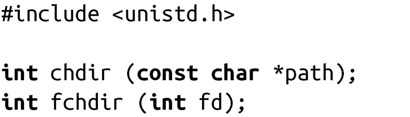
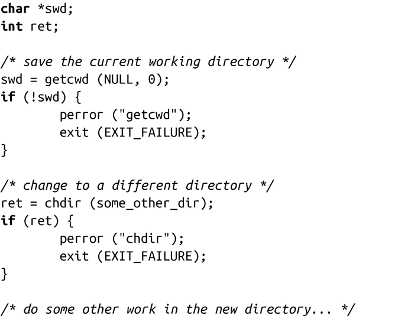
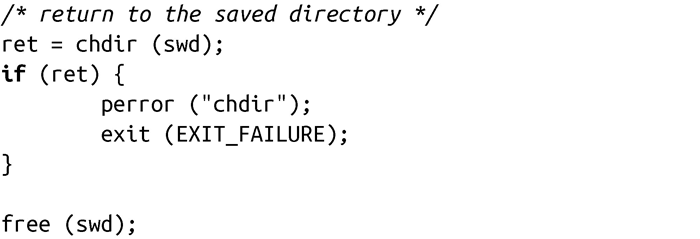
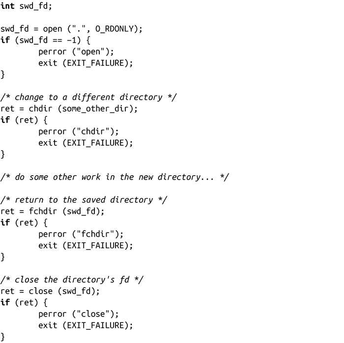

### 8.2.1　获取当前工作目录

获取当前工作目录的首选方法是使用POSIX的标准系统调用getcwd()：

成功调用getcwd( )会把当前工作目录以绝对路径名形式拷贝到由buf指向的长度为size字节的缓冲区中，并返回一个指向buf的指针。失败时，调用返回NULL，并相应设置errno值为下列值之一：

EFAULT buf指针非法。

EINVAL size值为0，但buf不是NULL。

ENOENT当前工作目录不再有效。如果当前工作目录被删除，会出现这种情况。

ERANGE size值太小，无法将当前工作目录保存至buf。应用程序需要分配更大的缓冲区并重试。

下面是使用getcwd()的一个例子：

POSIX指出如果buf是NULL，getcwd()的行为是未定义的。在这种情况下，Linux的C库将分配一个长度size字节的缓冲区，并在那存储当前工作目录。如果size为0，C库将分配足够大小的缓冲区存储当前工作目录。调用结束后，则由应用程序负责使用free()来释放缓冲区。因为这是Linux特有的处理方式，如果应用程序希望值可移植或严格遵守 POSIX，不应该使用这种方式。该特性的用法非常简单！请看下面这个示例：

Linux的C库也提供get_current_dir_name() 函数，当传递buf为Null并且size为0时，其行为与getcwd( )一致：

因此，这部分与之前的相同：

较早的BSD系统喜欢系统调用getwd()，Linux对其提供向后兼容：

调用getwd（）会把当前工作目录拷贝到buf中，buf的字节长度至少为PATH_MAX。成功时，调用会返回buf指针，而失败时，返回NULL。举个例子：

出于移植性与安全性双重原因，应用程序不应该使用getwd()，推荐使用getcwd()。

#### 改变当前工作目录

当用户第一次登入系统时，登录进程会把其当前工作目录设置home目录，在/etc/passwd中指定该home目录。但是，在某些情况下，某个进程希望改变其当前工作目录。例如，在shell下，可以通过键入cd改变当前工作目录。

Linux提供了两个系统调用来更改当前工作目录，一个接受目录路径名，而另一个接受指向已打开目录的文件描述符，如下：

调用chdir()会把当前工作目录更改为path指定的路径名，该路径名可以是绝对路径，也可以是相对路径。同样，调用fchdir()会把当前工作目录更改为文件描述符fd指向的路径名，而fd必须是打开的目录。成功时，两个调用都返回0；失败时，都返回-1。

失败时，chdir()还会相应设置errno值为下列值之一：

EACCES 调用的进程缺少对路径path中某一目录的搜索权限。

EFAULT path指针非法。

EIO 发生内部I/O错误。

ELOOP 内核解析path时遇到太多符号链接。

ENAMETOOLONG path太长。

ENOENT path指向的目录不存在。

ENOMEM 剩余内存不足，无法完成请求。

ENOTDIR 路径path中的一个或多个组成部分不是目录。

fchdir()会相应设置errno值为下列值之一：

EACCES 调用的进程缺少对fd指向的路径目录的搜索权限（比如未设置“执行位”）。当最上层目录可读，但不可执行时则会出现这种情况，在这种情况下，open()会成功，但fchdir()会失败。

EBADF fd不是一个已打开的文件描述符。

对于不同的文件系统，这两个调用可能会有其他的错误值。

这些系统调用只对当前运行的进程有影响。在UNIX中，没有更改不同进程当前工作目录的机制。因此，在shell下的cd命令（和大多数命令一样）不可能是一个独立的进程，只是简单地把第一个命令行参数传递给chdir()执行，然后退出。相反地，cd必须是个特殊的内置命令，使得shell本身调用chdir()，改变其当前工作目录。

getcwd()调用最常见的使用方式是用来保存当前工作目录，从而进程稍后可以返回它。例如：

但是，最好先调用open()打开当前目录，然后再调用fchdir()，这样做往往会更快一些，因为内核不在内存中保存当前工作目录的路径名，它只保存inode。因此，不管用户何时调用getcwd()，内核必须通过遍历目录结构，生成路径名。相反地，打开当前工作目录的开销更少，因为内核中已经有了该目录的inode，不需要使用人类可读的路径名来打开文件。下面的代码段使用了这种方法：

以上代码说明了shell如何实现缓存之前的目录（例如，在bash中执行cd -）。

不关心其当前工作目录的进程（比如守护进程），往往会调用chdir(“/”)，把当前工作目录设置为/。而对于需要和用户及其数据进行交互的应用(比如文字处理器)，通常会把它的当前工作目录设置为用户的home目录，或设置成某个特殊的文档目录。由于在相对路径名情况下，只能使用当前工作目录，因此更改当前工作目录是用户在shell上执行的命令行工具中最实用的。

