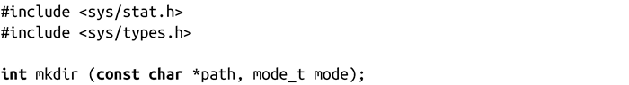

### 8.2.2　创建目录

Linux为创建新目录提供了一个标准的POSIX系统调用：

成功调用mkdir()会创建参数path所指定的目录（可能是相对或绝对路径），其权限位为mode（可以通过umask修改），并返回0。

umask可以修改参数mode，并和操作系统特定的模式位进行计算：在Linux，新建目录的权限位是（mode & ~umask & 01777）。换句话说，umask为进程施加的mode限制是mkdir()必须遵循的。如果新目录的父目录拥有已设置的用户组ID（sgid）位设置，或文件系统以BSD的组方式被挂载，新目录将从父目录继承用户组从属关系。否则进程有效用户组ID将应用于新目录。

调用失败时，mkdir()返回-1，并相应设置errno值为下列值之一：

EACCES当前进程对父目录不可写，或path参数中的一个或多个组成部分不可搜索。

EEXIST path已存在（且非必要的目录）。

EFAULT path指针非法。

ELOOP 内核解析path时遇到太多符号链接。

ENAMETOOLONG path太长。

ENOENT path的某个组成部分不存在或是一个无效的符号链接。

ENOMEM 剩余内存不足，无法完成请求。

ENOSPC 包含path的设备空间用尽，或用户磁盘配额已超限。

ENOTDIR path的一个或多个组成部分不是目录。

EPERM 包含path的文件系统不支持目录创建。

EROFS 包含path的文件系统只读。

