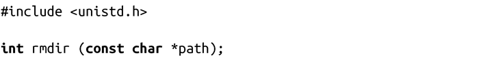
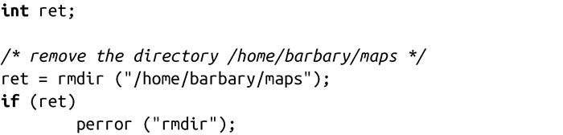

### 8.2.3　删除目录

与mkdir()对应，标准的POSIX调用rmdir()会将目录从文件系统层次上删除：

调用成功时，rmdir()会从文件系统删除path，并返回0。path指向的目录必须为空，除了“.”和“..”目录以外。没有支持类似rm -r一样递归删除功能的系统调用。要实现rm -r功能，首先要执行文件系统的深度优先搜索，从叶节点开始删除所有文件与目录，并返回至文件系统。当目录内的文件被全部删除时，则可以使用rmdir()来删除该目录。

调用失败时，rmdir()返回-1，并相应设置errno值为下列值之一：

EACCES path的父目录不允许写入，或路径path中的某个组成部分不可搜索。

EBUSY 系统正在使用path，不可删除。在Linux，只有当path是挂载点或根目录（幸运的是，有了chroot()调用，根目录不必是挂载点！）时才可能发生。

EFAULT path指针非法。

EINVAL path目录的最后组成部分是的“.”。

ELOOP 内核解析path时遇到太多符号链接。

ENAMETOOLONG path太长。

ENOENT path中一部分不存在或一个无效的符号链接。

ENOMEM 剩余内存不足，无法完成请求。

ENOTDIR path的一个或多个组成部分不是目录。

ENOTEMPTY path包含除了特殊的.和..之外的目录项。

EPERM path的父目录设置了粘贴位（S_ISVTX），但进程的有效用户ID既不是父目录也不是path本身的用户ID，且进程不具有CAP_FOWNER权限。基于以上两个原因之一，包含path的文件系统不允许删除目录。

EROFS 包含path的文件系统以只读方式加载。

下面是个简单的例子：

