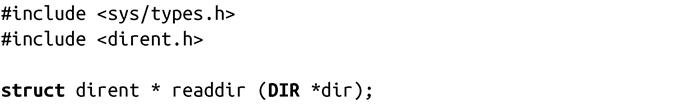
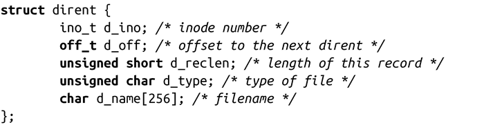
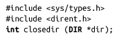

### 8.2.4　读取目录内容

POSIX定义了一系列函数，可以读取目录内容——即获取位于指定目录的文件列表。这些函数在以下方面都很有用：实现类似ls或图形化的文件保存对话框，需要操作给定目录下的每个文件，在目录下搜索匹配给定模式的文件。

开始读取目录内容前，首先需要创建一个由DIR对象指向的目录流（directory stream）：

成功调用opendir()，会创建由参数name所指向的目录的目录流。

目录流与指向打开目录的文件描述符所持有的信息几乎相同，包含一些元数据以及保存目录内容的缓冲区。因此，可以在给定目录流中获取该目录的文件描述符：

成功调用dirfd()会返回目录流dir的文件描述符。出错时，dirfd()调用会返回-1。由于目录流函数只能在内部使用该文件描述符，程序只能调用那些不操作文件位置的系统调用。dirfd()是BSD的扩展，但不是POSIX标准函数，希望遵循POSIX标准的程序员应该避免使用它。

#### 从目录流读取

使用opendir()创建一个目录流后，程序可以从目录中读取目录项。为了实现这一点，可以使用readder()，从给定DIR对象中依次返回目录项：

成功调用readdir()，会返回dir指向的下一个目录项。dirent结构体指向目录项，其在Linux的<dirent.h>中的定义如下：

POSIX只需要字段d_name，该字段是目录内单个文件名。其他字段是可选的，或Linux特有的。如果应用希望可以移植到其他系统，或与保持POSIX一致，应该只使用d_name字段。

应用连续调用readdir()，获取目录中的每个文件，直至找到其要搜索的文件，或直到整个目录已读完，如果是后者，readdir()会返回NULL。

失败时，readdir()也会返回NULL。为了区别出错和已读完整个目录，应用程序必须在每次调用readdir()之前将errno设置为0，并在之后检查返回值和errno值。readdir()设置的唯一errno值是EBADF，意味着参数dir无效。因此，对许多应用程序而言，没有必要检查错误，直接假定NULL表示已经读完整个目录。

#### 关闭目录流

使用closedir()关闭由opendir()打开的目录流：

closedir()调用成功时，会关闭由dir指向的目录流，包括目录的文件描述符，并返回0。失败时，函数返回-1，并设置errno为EBADF，这是唯一可能的错误码，意味着dir不是一个打开的目录流。

下面的代码段实现了函数find_file_in_dir()，它使用readdir()在给定目录中搜索指定文件。如果文件在目录中存在，函数返回0。否则，返回非0值：

#### 用于读取目录内容的系统调用

前面讨论的读取目录内容的函数都是由C库提供的标准POSIX函数。在这些函数内部，会使用系统调用readdir()和getdents()，出于完整性考虑，这里也给出这两个系统调用：

你最好不要使用这些系统调用！它们很晦涩，而且不可移植。相反，用户空间的应用应该使用C库的系统调用opendir()、readdir()和closedir()。

