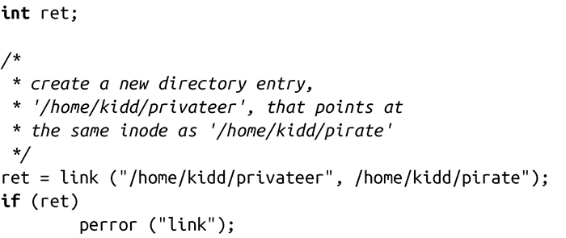

### 8.3.1　硬链接

作为初始的UNIX系统调用之一，link()已经成为POSIX标准，我们可以使用link()为已有的文件创建新链接：

成功调用link()会为oldpath所指向的已存在的文件，在路径newpath下创建新的链接，并返回0。调用完成后，oldpath和newpath都会指向同一个文件——实际上，我们无法区分哪个是“初始”链接。

失败时，调用返回-1，并相应设置errno值为下列值之一：

EACCES 调用的进程缺少对路径oldpath某组成部分的搜索权限，或没有对包含newpath目录的写权限。

EEXIST newpath已存在——link()将不会覆盖已存在的目录项。

EFAULT oldpath或newpath指针非法。

EIO 发生内部I/O错误（这个后果很严重！）。

ELOOP 解析oldpath或newpath时遇到太多的符号链接。

EMLINK oldpath指向的inode数已达到指向它的最大链接数。

ENAMETOOLONG oldpath或newpath太长。

ENOENT oldpath或newpath的某个组成部分不存在。

ENOMEM 剩余内存不足，无法完成请求。

ENOSPC 包含newpath的设备没有建立新目录项的空间。

ENOTDIR oldpath或newpath组成不是目录。

EPERM 包含newpath的文件系统不允许创建新的硬链接，或oldpath是目录。

EROFS newpath位于只读文件系统上。

EXDEV newpath和oldpath不在同一文件系统上。（Linux允许单个文件系统挂载在多个地方，但即使这样，硬链接也不能跨越挂载点创建。）

这个示例会创建新的目录项pirate，它与已有的文件privateer都指向同一个inode（即同一个文件），pirate和privateer都在/home/kidd目录下：

