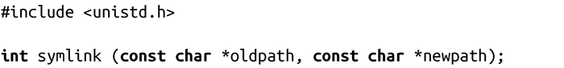
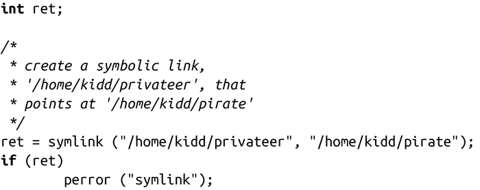

### 8.3.2　符号链接

符号链接，也称为symlinks或软链接。它和硬链接的相同之处在于二者均指向文件系统中的文件，不同点在于符号链接不会增加额外的目录项，而是一种特殊的文件类型。该文件包含被称为符号链接指向的其他文件（一般称为符号链接的目标文件）的路径名。运行时，内核用该路径名代替符号链接的路径名（除非使用系统调用是以“l”开头的系统调用，例如lstat()，它操作链接本身而非目标文件）。因此，一个硬链接与指向同一文件的另一个硬链接很难区分，但很容易区分符号链接以及其目标文件。

符号链接可能是相对或绝对路径名。它可以包含之前讨论的指向目录本身的特殊.目录，或指向该目录父目录的..目录。这种“相对”的符号链接很常见，而且很有用。

软链接和硬链接相比，很重要的一个区别点在于它可以跨越不同的文件系统。实际上，软链接可以指向任何位置！符号链接能指向已存在（通常用法）或不存在的文件。后者被称为“悬空的符号链接（dangling symlink，或称无效的符号链接）。有时，悬空的符号链接是指不再需要的——例如当链接目标已删除，但符号链接没有删除时，该符号链接就变成悬空的了——但是，在某些情况下是故意的。符号链接还可以指向其他符号链接，这样就会存在环。处理符号链接的系统调用通过维护最大遍历深度来查看是否存在环。如果超过深度，就返回ELOOP。

创建符号链接的系统调用和创建硬链接的系统调用非常类似：

symlink()调用成功时，会创建符号链接newpath，指向由oldpath所表示的目标文件，并返回0。

出错时，symlink()会返回-1，并相应设置errno值为下列值之一：

EACCES 调用的进程缺少对oldpath某组成部分的搜索权限，或没有对包含newpath的目录写权限。

EEXIST newpath已存在——symlink()将不会覆盖存在的目录项。

EFAULT oldpath或newpath指针非法。

EIO 发生内部I/O错误（这个后果很严重！)。

ELOOP 解析oldpath或newpath时遇到太多符号链接。

EMLINK oldpath指向的inode已达到指向它的最大链接数。

ENAMETOOLONG oldpath或newpath太长。

ENOENT oldpath或newpath的某组成部分不存在。

ENOMEM 剩余内存不足，无法完成请求。

ENOSPC 包含newpath的设备没有建立新目录项的空间。

ENOTDIR oldpath或newpath的某组成部分不是目录。

EPERM 包含newpath的文件系统不允许新符号链接的创建。

EROFS newpath位于只读文件系统上。

下面这个代码片段与前面给出的示例很相似，它创建了一个符号链接（与硬链接相对）/home/kidd/privateer，指向目标文件/home/kidd/pirate：

