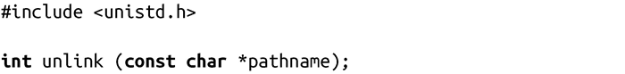
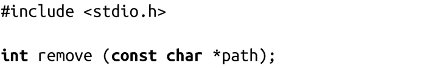

### 8.3.3　解除链接

建立链接的反向操作是解除链接（unlinking），即从文件系统中删除路径名。只需要调用系统调用unlink()，就可以完成该任务：

unlink()调用成功时，会从文件系统中删除pathname，并返回0。如果该路径是指向文件的最后一个链接，则会从文件系统中删除该文件。如果进程打开文件，在进程关闭文件前，内核不会从文件系统中删除文件。若没有进程打开该文件，文件会被删除。

如果pathname指向符号链接，则只会删除链接，而不会删除目标文件。

如果pathname指向的是特殊类型的文件（例如设备、FIFO或socket），调用会从文件系统删除该文件，但打开文件的进程可以继续使用它。

出错时，unlink()返回-1，并相应设置errno值为下列值之一：

EACCES 调用的进程没有对pathname父目录的写权限，或没有对pathname某部分的搜索权限。

EFAULT pathname指针非法。

EIO 发生内部I/O错误(这很严重！)。

EISDIR pathname指向一个目录。

ELOOP 解析pathname时遇到太多符号链接。

ENAMETOOLONG pathname太长。

ENOENT pathname组成不存在。

ENOMEM 剩余内存不足，无法完成请求。

ENOTDIR pathname的某部分不是目录。

EPERM 系统不允许解除链接。

EROFS pathname位于只读文件系统上。

unlink()不会删除目录。因此，应用程序应使用我们之前讨论（见8.2.3节）的rmdir()来删除目录。

为了简化对各种类型文件的删除，C语言提供函数remove()：

成功调用remove()时，会从文件系统删除path，并返回0。如果path是个文件，remove()会调用unlink()；如果path是个目录，remove()会调用rmdir()。

出错时，remove()返回-1，其errno可以是调用unlink()和rmdir()中出现的所有可能的错误码。

