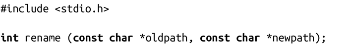

### 8.4.2　移动

和拷贝文件操作不同，UNIX还提供了移动文件的系统调用。ANSI C标准中介绍了关于多文件操作的调用，POSIX标准中对多文件和目录操作都支持：

成功调用rename()时，会将路径名oldpath重命名为newpath。文件的内容和inode保持不变。oldpath和newpath必须位于同一文件系统中<a class="my_markdown" href="['#anchor86']">[6]</a>，否则调用会失败。类似mv的工具必须通过调用拷贝和解除链接来完成rename操作。

成功时，rename()会返回0，原来由oldpath指向的文件现在变成由newpath指向。失败时，调用会返回-1，但不影响oldpath或newpath，并相应设置errno值为下列值之一：

EACCES 可能是以下三种情况之一：调用进程缺少对oldpath或newpath父目录的写权限；调用进程缺少对oldpath或newpath中某个目录的搜索权限；oldpath是个目录，但调用进程缺少对oldpath的写权限。最后一种情况实际是因为当oldpath是个目录时，rename()必须更新oldpath目录下的..目录。

EBUSY oldpath或newpath是挂载点。

EFAULT oldpath或newpath指针非法。

EINVAL newpath包含在oldpath中，因此，重命名会导致oldpath变成自己的子目录。

EISDIR newpath存在且是目录，但oldpath不是目录。

ELOOP 解析oldpath或newpath时，遇到太多符号链接。

EMLINK oldpath的链接数目已达到最大值，或oldpath是个目录，且newpath的链接数目已达到最大值。

ENAMETOOLONG oldpath或newpath字符串长度太长。

ENOENT oldpath或newpath的某部分不存在，或是个悬空的符号链接。

ENOMEM 剩余内核空间不足，无法完成请求。

ENOSPC 剩余设备空间不足，无法完成请求。

ENOTDIR oldpath或newpath的某部分（除了目录的最后一部分）不是目录，或oldpath是目录，但newpath存在但不是目录。

ENOTEMPTY newpath是目录且非空。

EPERM参数中指定的某个路径，其父目录已设置粘贴位（sticky bit），而调用进程的有效用户ID既不是文件用户ID也不是其父目录的用户ID，且该进程没有特权。

EROFS文件系统标记为只读。

EXDEV oldpath和newpath不在同一个文件系统中。

表8-1给出了不同类型文件相互移动的结果。

<b class="my_markdown">表8-1　不同类型文件互相移动的结果</b>

| 目标是个文件 | 目标是个目录 | 目标是个链接 | 目标不存在 |
| :-----  | :-----  | :-----  | :-----  | :-----  | :-----  |
| 源是个文件 | 目标被源覆盖 | 失败，errno值为EISDIR | 文件被重命名，目标被覆盖 | 文件被重命名 |
| 源是个目录 | 失败，errno值为ENOTDIR | 如果目标为空，把源重命名为目标；否则会失败，errno值为EISDIR。 | 目录被重命名，目标被覆盖。 | 目录被重命名 |
| 源是个链接 | 链接会重命名，目标被覆盖 | 失败，errno值为EISDIR。 | 链接被重命名，目标被覆盖。 | 链接被重命名 |
| 源不存在 | 失败，errno值为ENOENT | 失败，errno值为ENOENT | 失败，errno值为ENOENT | 失败，errno值为ENOENT |

对以上所有情况，不论是什么类型，如果源和目标位于不同的文件系统上，调用都会失败并返回EXDEV。

