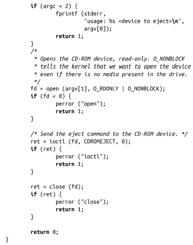

### 8.6　带外通信（Out-of-Band Communication）

UNIX的文件模型很典型。只需要通过简单的读写操作，UNIX几乎对一个对象上所有可能的操作都进行了抽象。但是，在某些情况下，开发人员需要和UNIX基本数据流外的文件通信。例如，对于一个串口设备，对设备的读取将从该串口设备的远端硬件读取，写入设备将向该硬件发送数据。进程如何读取串口的特定状态针（比如数据终端就绪（DTR）信号）？此外，进程如何设置串口的奇偶校验？

答案是使用系统调用ioctl()。顾名思义，ioctl表示I/O控制，可以通过它进行带外通信：

该系统调用需要两个参数：

fd 文件的文件描述符。

request 特殊请求代码值，该值由内核和进程预定义，它指明对fd所指向的文件执行哪种操作。

它还可能接收一个或多个隐式可选参数（通常是无符号整数或指针），并传递给内核。

以下程序会使用CDROMEJECT请求，可以从CD-ROM设备弹出多媒体光盘设备，设备是由用户指定，即程序命令行的第一个参数。该程序的功能和eject命令类似：

CDROMEJECT请求是Linux CD-ROM设备驱动的一个特性。当内核接收到ioctl()请求时，它寻找对应文件描述符的文件系统（真实文件）或设备驱动（设备节点），并传递处理请求。CD-ROM设备驱动接收请求并物理弹出驱动器。

在本章稍后，我们将看到一个ioctl()实例，它使用可选参数返回请求进程信息。

