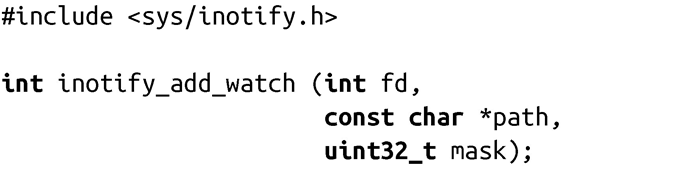
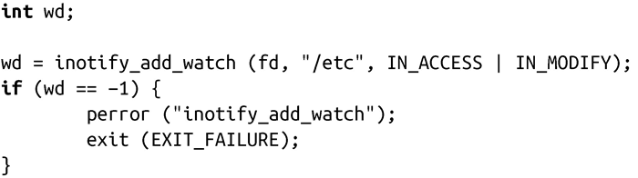

### 8.7.2　监视

进程完成inotify初始化之后，会设置监视（watches）。监视是由监视描述符（watch descriptor）表示，由一个标准UNIX路径以及一组相关联的监视掩码（watch mask）组成。监视掩码会通知内核，该进程关心哪些事件（比如读取、写入操作或二者兼有）。

inotify可以监视文件和目录。当监视目录时，inotify会报告目录本身和该目录下的所有文件事件（但不包括监视目录的子目录下的文件——监视不是递归的）。

添加一个新的监视

系统调用inotify_add_watch()会在文件或目录path上添加一个监视，监视事件是由mask确定，监视实例由fd指定：

成功时，inotify_add_watch()调用会返回新建的监视描述符。失败时，返回-1，并相应设置errno值为下列值之一：

EACCES不允许读取path指定的文件。添加监视的进程必须能读取该文件。

EBADF文件描述符fd是无效的inotify实例。

EFAULT无效的path指针。

EINVAL监视掩码mask包含无效的事件。

ENOMEM剩余内存不足，无法完成请求。

ENOSPC inotify监视总数达到用户上限。

#### 监视掩码

监视掩码由一个或多个inotify事件的二进制或运算生成，其定义在<inotify.h>：

IN_ACCESS 从文件中读取。

IN_MODIFY 写入文件中。

IN_ATTRIB 文件的元数据（例如所有者、权限或扩展属性）发生变化。

IN_CLOSE_WRITE 文件已关闭，且已经以写入模式打开。

IN_CLOSE_NOWRITE 文件已关闭，且未曾以写入模式打开。

IN_OPEN 文件已打开。

IN_MOVED_FROM 文件已从监视目录中删除。

IN_MOVED_TO 文件已添加到监视目录。

IN_CREATE 文件已在监视目录创建。

IN_DELETE 文件已从监视目录删除。

IN_DELETE_SELF 监视对象本身已删除。

IN_MOVE_SELF 监视对象本身已删除。

还定义了以下事件，把两个或多个事件组合成单个值：

IN_ALL_EVENTS 所有合法的事件。

IN_CLOSE所有涉及关闭的事件（当前，即设置了IN_CLOSE_WRITE和IN_ CLOSE_NOWRITE的事件）。

IN_MOVE 所有涉及删除的事件（当前，即设置了IN_MOVED_FROM和IN_ MOVED_TO的事件）。

现在，我们来看看如何在一个已存在的inotify实例中添加一个新的监视：

该例子会对目录/etc下的所有读写操作添加一个新的监视。如果/etc下所有文件被读取或写入，inotify会向其文件描述符fd发送事件，这个事件提供监视描述符 wd。我们一起来看一下inotify是如何表示这些事件的。

