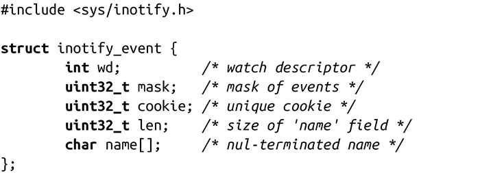
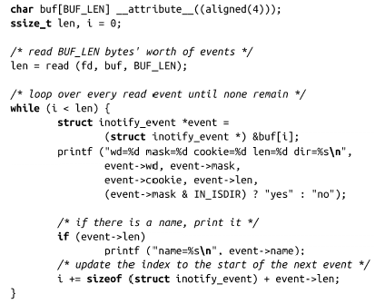
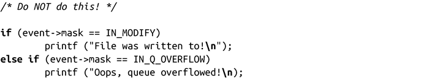
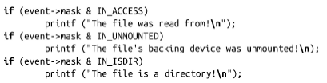

### 8.7.3　inotify事件

结构体inotify_event描述了inotify事件，在<inotify.h>文件中定义如下：

wd表示监视描述符，是调用inotify_add_watch()生成，mask表示事件。如果wd标识的描述符是个目录，且该目录下的文件发生监视事件，数组name[]就保存和路径相关的文件名。在这种情况下，len值不为零。需要注意的是，len的长度和字符串name的长度不一样，name可以包含多个null字符进行填充，以确保后续的inotify_event能够正确对齐。因此，在计算数组中下一个inotify_event结构体的偏移时，必须使用len，而不能使用strlen()。

**零长度数组（Zero-Length Arrays）** 
 这里，name是个典型的零长度数组。零长度数据，也称为灵活数组，是个C99语言特性，支持创建变长数组。零长度数组有个很强大的功能：在结构体中嵌入变长数组。可以把零长度数组想象成一些指针，其内容和指针本身内联。在inotify这个例子中：在结构体中存储文件名的一种常见方式是包含name字段，比如name[512]。但是在所有文件系统中，不存在文件名长度上限。任何值都可能限制了inotify功能。此外，很多文件名很小，因此如果缓存很大，对大多数文件会是个很大的浪费。这种场景其实并不少见，典型的解决方式就是把name作为指针，在其他地方动态分配缓存，再把name指向该缓存，但是这种方式对于系统调用并不合适，而零长度数组则是其最佳的解决方案。

举个例子，当wd指向/home/kidd，其掩码为IN_ACCESS，当读取文件/home/kidd/ canon时，name就会等于canon，且len值至少为6。相反地，如果直接以同一掩码直接监视/home/kidd/canon，len值将为0，且name长度为0（注意，一定不要改变它）。

cookie通常用于连接两个独立但相关的事件。我们将在后续章节讨论它。

#### 读取inotify事件

很容易获取inotify事件：仅需读取与inotify实例相关联的文件描述符即可。inotify提供slurping特性，该特性支持通过单个读请求读取多个事件（具体数量受read()缓冲区大小限制）。可变长字段name是读取inotify事件最常用的方法。

在前一个例子中，我们实例化了inotify实例，并为该实例添加监视。现在，让我们读取未处理的事件：

因为inotify文件描述符的操作与普通文件一样，程序可以通过select()、poll()和epoll()监视它。这允许进程使用单线程在进行其他文件I/O时来多路传输inotify事件。

#### 高级inotify事件

除了标准事件外，inotify还可以产生其他事件：

IN_IGNORED wd指向的监视描述符已删除。当用户手动地删除监视或者当监视对象不再存在时，会发生这种情况。我们将随后讨论该事件。

IN_ISDIR 目标对象是个目录。（如果没有设置该标识位，目标对象默认是文件。）

IN_Q_OVERFLOW inotify队列溢出。为避免内核内存无限制消耗，内核对事件队列的大小做了限制。一旦未处理的事件数增长到比上限值少1时，内核会生成该事件，并将其添加至队列尾部。在队列被读取，其大小减小至限制值以下前，不会再有事件产生。

IN_UNMOUNT 监视对象所在的设备未挂载。因此，对象不再有效。内核将删除监视，并生成IN_IGNORED事件。

所有监视都能产生这些事件，用户没必要专门设置它们。

程序员必须将掩码视为未处理事件的位掩码。因此，不要使用直接等价测试来检查事件：

相反，应该进行按位测试：

#### 关联“移动（Move）”事件

N_MOVED_FROM和IN_MOVED_TO事件各自代表移动动作的一半：前者描述从给定位置删除，而后者描述移动到新位置。因此，为了让那些“智能”跟踪文件移动的程序更加有效（例如，索引程序不会对移动的文件重排索引），进程需要将两个移动事件关联起来。

我们来看一下inotify_event结构体中的cookie字段。

如果cookie字段非零，则包含一个唯一值，可以将两个事件进行关联。假设进程正在监视/bin和/sbin。假定/bin 的监视描述符是7，而/sbin的监视描述符是8。如果文件/bin/compass移至/sbin/compass，内核将产生两个inotify事件。

第一个事件将使wd等于7，mask等于IN_MOVED_FROM，且name为compass。第二个事件将使wd等于8，mask等于IN_MOVED_TO，且name为compass。在两个事件中，cookie相同——12。

如果文件被重命名，内核仍产生两个事件。两个事件的wd是一样的。

需要注意的是，如果文件移入或移出一个未监视的目录，进程将不会收到其中的一个事件。是否通知第二个符合cookie的事件永远不会到来，则是由程序决定的。

