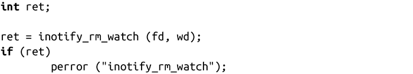

### 8.7.5　删除inotify监视

就像该实例所示，你能通过系统调用inotify_rm_watch( )从inotify实例中删除监视：

成功调用inotify_rm_watch()会从inotify实例（由文件描述符指向的）fd中删除由监视描述符wd指向的监视，并返回0。

例如：

失败时，系统调用返回-1，并相应设置errno值为下列值之一：

EBADF无效的inotify实例fd。

EINVAL wd不是给定inotfy实例上的有效监视描述符。

当删除监视时，内核产生IN_IGNORED事件。内核在手动删除监视和其他操作所引发的删除监视时都会发送该事件。例如，当监视的文件已删除，文件的所有监视也被删除。因此，内核发送IN_IGNORED。该特性可以使应用程序用专门的IN_IGNORED事件处理函数来强化对事件的删除处理。对于类似GNOME’s Beagle搜索架构这种需要管理大量复杂的数据结构上的监视的应用是非常有帮助的。

