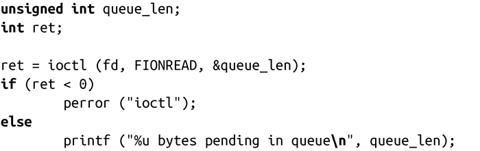

### 8.7.6　获取事件队列大小

未处理事件队列大小可以通过在inotify实例文件描述符上执行ioctl（参数为FIONREAD）来获取。请求的第一个参数获得以无符号整数表示的队列的字节长度：

记住，请求所返回的是队列的字节大小，而非队列的事件数。程序可以使用结构inotify_event（通过sizeof()获取）的大小和对字段name平均大小的猜测，来估算事件数。然而更有帮助的是，进程可以通过未处理的字节数来获知将要读取的长度。

头文件<sys/ioctl.h>定义了常量FIONREAD。

