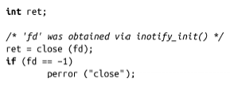

### 8.7.7　销毁inotify实例

销毁inotify实例及与其关联的监视和关闭实例的文件描述符一样简单：

当然，与一切文件描述符一样，内核自动关闭文件描述符，并在进程退出时回收资源。

<a class="my_markdown" href="['#ac81']">[1]</a> 有趣的是，inode没有存储文件名！在目录项中保存文件名。

<a class="my_markdown" href="['#ac82']">[2]</a> 注：当然，在inode空间用完之后，ext4在额外的文件系统块存储扩展属性。

<a class="my_markdown" href="['#ac83']">[3]</a> 注：需要注意的是，该限制是255个字节，而非255个字符。多字节的字符显然一个字符占用多于一个字节。

<a class="my_markdown" href="['#ac84']">[4]</a> 注：当然，Linux对较老的文件系统提供向后兼容性，例如FAT，仍然保持它们自己的限制。对于FAT，每个文件名的限制是八个字符，其次是一个''.''，最后是三个字符。确实，在文件系统中强制使用“.”作为特殊字符是很愚蠢的。

<a class="my_markdown" href="['#ac85']">[5]</a> 注：文件系统检测工具fsck的主要工作就是寻找链接计数为0，且块标记为已分配的文件。这样的情况通常发生在文件已删除，但仍然保持打开状态，在文件关闭前发生系统崩溃。内核不能标记文件系统块为空闲，以避免引起不一致问题。日志文件系统可以消除这类错误。

<a class="my_markdown" href="['#ac86']">[6]</a> 注：虽然Linux允许在目录结构下多点挂载设备，即使它们在同一设备上，但仍不能将挂载点重命名为另外一个。

