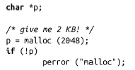
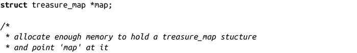
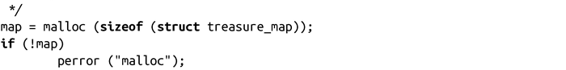
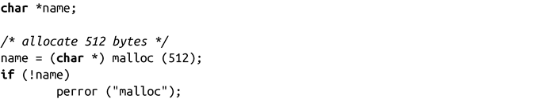
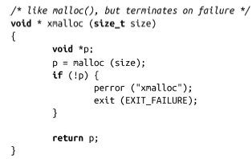

### 9.2　动态内存分配

内存同样可以通过自动变量和静态变量获得，但是所有内存管理系统的基础都是关于动态内存的分配、使用以及最终的返回。动态内存是在进程运行时才分配的，而不是在编译时就分配好了，而分配的大小也只有在分配时才确定。作为开发人员，以下两种场景需要使用动态内存：一是在程序运行前不知道需要多大空间，二是需要使用这块内存的时间不确定。举个例子，你可能需要把一个文件或者用户的键盘输入保存到内存中，在这种场景下，可以使用动态内存。由于文件大小未知，且用户从键盘输入内容的长度不确定，因此缓冲区的大小是变化的，随着程序读到的数据增多，应该动态增大内存。

C不提供支持动态内存的变量。例如，C不会提供在动态内存中获取结构体struct pirate_ship机制，而是提供了一种机制，可以在动态内存中分配一个足够大的空间来保存结构体pirate_ship。然后，编程人员可以通过指针对这块内存进行操作——在这个例子中，该指针即struct pirate_ship*。

C中最经典的获取动态内存的接口是malloc()：

成功调用malloc()时，会得到size大小的内存区域，并返回指向新分配的内存首地址的指针。这块内存区域的内容是未定义的，不要把它们当作全是0。失败时，malloc()返回NULL，并把errno值设置为ENOMEM。

malloc()的使用非常简单，正如在下面的例子中，使用它来分配固定字节大小的内存：

或者如下，分配一个结构体：

每次调用时，C都会自动地把返回值由void指针转变为需要的类型。所以，这些例子在调用时并不需要把malloc()的返回值强制类型转换为一个左值类型。但是在C++中，并不提供这种自动转换。因而，C++的使用者需要如下对malloc()的返回值做强制类型转换：

一些C编程人员喜欢将所有返回指针函数（包括malloc）的返回值强制类型转换为void。我非常反对这种行为，因为这么做会潜在一些问题，当函数的返回值变为其他不是void的指针时就会出错。此外，如果函数没有正确声明时，这种强制类型转换还会隐藏bug<a class="my_markdown" href="['#anchor94']">[4]</a>。虽然使用malloc不会产生前一个问题，却很有可能会发生后一个问题。

> 未声明的函数默认会返回int类型。不会自动从整数类型转换成指针类型，会生成一条告警。强制类型转换可以避免这种告警。

因为malloc可以返回NULL，对于编程人员而言，总是检查并处理错误是非常重要的。很多程序都定义和使用封装后的malloc()，当malloc()返回NULL时就打印错误，并终止程序。按惯例，编程人员把该封装称为xmalloc()：

