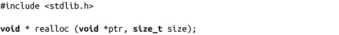
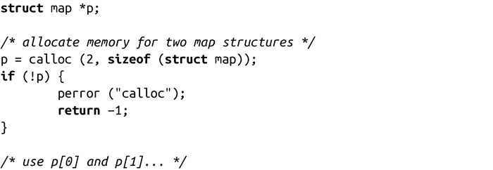
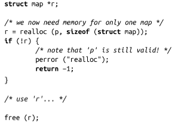

### 9.2.2　调整已分配内存大小

C语言提供了一个接口，可以改变（变大或变小）已分配的动态内存大小：

成功调用realloc()会把ptr指向的内存区域的大小变为size字节。它返回一个指向新空间的指针，返回的指针可能是ptr，也可能不是。如果realloc()不能在已有的空间上增加到size大小，那么就会另外申请一块size大小的空间，将原本的数据拷贝到新空间中，然后再将旧的空间释放。在任何情况，会根据新旧区域中的较小的一个来保留原来内存区域的内容。因为有潜在的拷贝操作，所以一个扩大原区域的realloc()操作可能是相当耗时的。

如果size是0，其效果就和在ptr上调用free()相同。

如果ptr是NULL，调用realloc()的结果就和malloc()一样。如果ptr是非NULL的，那么它必须是之前调用的malloc()、calloc()或realloc()之一的返回值。

失败时，realloc()返回NULL，并设置errno值为ENOMEM。这时ptr指向的内存区域没有改变。

下面，我们来看看缩小原存储区域的情况。首先，调用calloc()来申请足够的空间来存放一个由两个map结构组成的数组：

现在，假定已经找到了需要的东西，不需要第二个map了。因此，应该修改内存块的大小，将一半的空间归还给系统。这个操作可能没有什么太大意义，但是当map结构非常大，而且另一个map保留很长时间时，就变得非常有意义了：

在本例中，realloc()调用后，p[0]被保留了下来。所有的数据原封不动。如果realloc()失败了，由于p没有被改变，所以该指针仍然有效。我们可以继续使用p，直到最后释放这部分内存。相反地，如果调用成功了，我们将不再使用p，后续使用r。这样，当完成所有操作时，需要把r释放掉。

