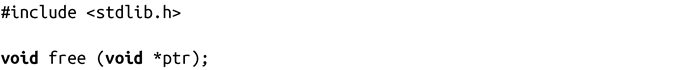
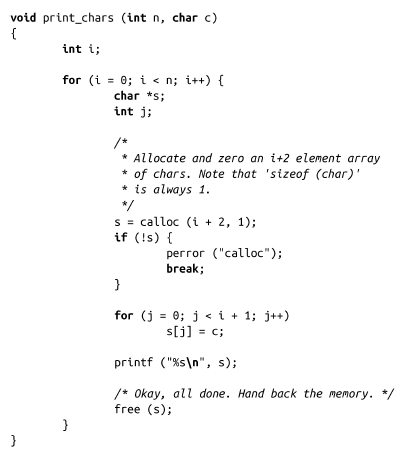
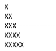

### 9.2.3　释放动态内存

对于自动分配的内存，当栈不再使用，空间会自动释放。与之不同的是，动态内存将永久占有一个进程地址空间的一部分，直到显式释放。因此，开发人员需要将申请到的动态内存释放掉，返回给系统。（当然，当整个进程都退出的时候，所有动态内存和静态内存都会被释放掉。）

通过malloc()、calloc()或者realloc()分配到的内存，当不再使用时，必须调用free()归还给系统：

调用free()会释放ptr所指向的内存，其参数ptr必须是通过调用malloc()、calloc()或者realloc()的返回值。也就是说，不能通过给free()函数传递一个指向已分配内存块的中间位置的指针，来释放申请到的内存的一部分，即已申请的内存块的一半。

ptr可能是NULL，这个时候free()什么都不做就返回，因此调用free()时并不需要检查ptr是否为NULL。

让我们看看下面这个例子：

在这个例子中，为n个字符数组分配了空间，这n个数组的元素个数依次递增，从两个元素（2字节）一直到n+1个元素（n+1字节）。然后，循环将数组中的最后一个元素外的元素赋值为c（最后一个字节为0），然后打印字符串，最后释放动态分配的内存。

调用print_chars()，当n等于5，c为X时，我们可以得到如下图形：

当然，还存在其他更高效的方法来实现这个功能。这里想要说明的是，即使要分配的内存块的大小和数量需要到运行时才能确定，我们也可以动态分配和释放内存。

> UNIX系统，如SunOS和SCO，提供了一个free()的变种函数cfree()，它的行为和具体系统有关，有可能跟free()一样，但也有可能类似calloc()那样，接收三个参数。在Linux中，free()能处理我们现在涉及的所有由动态存储机制分配到的内存。除非要考虑向后兼容，否则不应该使用cfree()。Linux的版本和free()一致。

需要注意的是，在这个例子中，如果不调用free()，会产生什么结果呢？程序将永远也不会将存储空间还给系统，更为糟糕的是，唯一指向这块区域的指针s会消失，使得我们再也无法访问这块内存。这类编程错误通常称为“内存泄漏（memory leak）”。内存泄漏以及一些类似的动态内存问题是很多程序中经常出现的，而不幸的是，它也是C语言编程中最致命的错误。由于C语言将所有的内存管理都交给编程人员，因此C编程人员必须对于所有的内存分配分外小心。

另外一个最常见的错误是“释放后再使用（use-after-free）”。这种错误行为发生在一块内存已经被释放后，而后续仍去访问它。一旦调用free()释放了某块内存，我们就再也不能对其进行操作了。编程人员需要特别注意那些“悬空指针”：非空指针，但指向的是不可使用的内存块。Valgrind是检测内存错误的一款非常优秀的工具。

