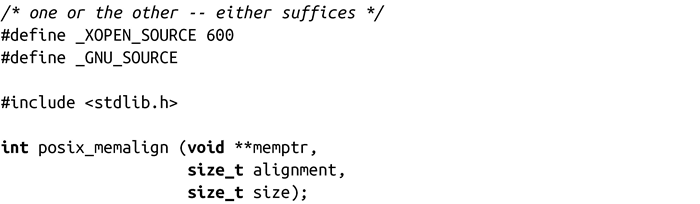
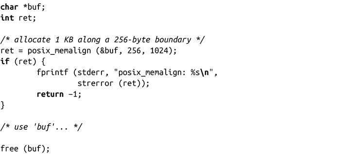
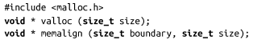
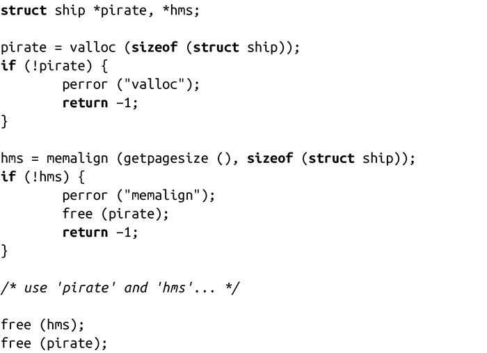
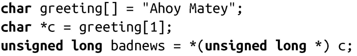

### 9.2.4　对齐

数据对齐（alignment）是指数据在内存中的存储排列方式。如果内存地址A是2的n次幂的整数倍，我们就说A是n字节对齐。处理器、内存子系统以及系统中的其他组件都有特定的对齐需求。举个例子，大多数处理器的工作单位是字，只能访问字对齐的内存地址。同样，正如前面所讨论的，内存管理单元也只处理页对齐的地址。

如果一个变量的内存地址是它大小的整数倍时，就称为“自然对齐（naturally aligned）”。例如，对于一个32位长的变量，如果它的地址是4（字节）的整数倍（也就是说，如果地址的低两位是0），那就是自然对齐了。因此，如果一个类型的大小是2n字节，那么它的内存地址至少低n位是0。

数据对齐的规则是依赖于硬件的，因此不同系统的对齐规则不同。有些体系的计算机在数据对齐方面有很严格的要求，而有的很松散。当数据不对齐时，有的系统会生成一个可捕捉的错误。内核可以选择终止该进程或（更多情况下是）手工处理没有对齐的访问（通常通过多个对齐访问完成）。这种处理方式会引起性能下降，但至少进程不会终止。在编写可移植的代码的时候，编程人员一定要注意不要破坏了数据对齐规则。

#### 预对齐内存的分配

在大多数情况下，编译器和C库会自动处理对齐问题。POSIX规定通过malloc()、calloc()和realloc()返回的内存空间对于C中的标准类型都应该是对齐的。在Linux中，这些函数返回的地址在32位系统是以8字节为边界对齐，在64位系统是以16字节为边界对齐的。

有时，编程人员需要动态分配更大的内存，如页。虽然有很多不同的目的，最常见的需求是要对直接块I/O或其他软硬件通信的缓冲区对齐。为此，POSIX 1003.1d提供了posix_memalign()函数：

调用成功时，会返回size字节的动态内存，并保证是按照alignment进行对齐的。参数alignment必须是2的整数幂，并且是void指针大小的整数倍。返回的内存块的地址保存在memptr里，函数调用返回0。

调用失败时，不会分配任何内存，memptr值未定义，返回如下错误码之一：

EINVAL 参数不是2的整数幂，或者不是void指针的整数倍。

ENOMEM 没有足够的内存来满足函数请求。

要注意的是，对于该函数，errno值不会被设置，而是直接在返回值中给出错误值。

由posix_memalign()获得的内存可以通过free()释放。用法很简单：

在POSIX定义了posix_memalign()调用之前，BSD和SunOS分别提供了如下接口：

函数valloc()的功能和malloc()完全一致，但返回的地址是页对齐的。回顾一下第4章，页的大小很容易通过getpagesize()得到。

函数memalign()和posix_memalign()类似，是以boundary字节对齐的，而boundary必须是2的整数幂。在这个例子中，这两个函数调用都返回一块足够大的内存，可以存放一个结构体ship，并且是页对齐：

在Linux中，由这两个函数调用获得的内存都可以通过free()释放。但是在别的UNIX系统上，却未必是这样，一些系统并没有提供一个足够安全的机制来释放这些内存。对于需要考虑可移植性的程序，有时可能没有别的选择，只能不要调用free ()去释放以上函数调用所申请的内存！

除非为了可移植到更老的系统上时，Linux编程人员都不要使用这两个函数。相反，应该优先选择posix_memalign()函数，它是标准的。这三个函数都只有在malloc()无法满足对齐需求时才使用。

#### 其他对齐问题

对齐问题并不局限于标准类型与动态内存分配的自然对齐。比如说，非标准的和复杂的数据类型的对齐问题会比标准类型的更复杂。另外，在对不同类型的指针进行赋值以及强制类型转换的时候，对齐问题就变得更为重要。

非标准和复杂的数据类型的对齐比简单的自然对齐有更多的要求，可以遵循以下四条规则：

+ 结构体的对齐要求和它的成员中最大的那个类型是一样的。例如，一个结构中最大的是以4字节对齐的32bit的整型，那么这个结构至少以4字节对齐。
+ 结构体也带来了填充问题，以此来保证每一个成员都符合各自的对齐要求。因此，如果一个char（很可能是以1字节对齐）后跟着一个int（很可能是以4字节对齐），编译器会自动地插入3个字节作为填充来保证int以4字节对齐。编程人员有时需要注意一下结构体中成员变量的顺序，比如按成员变量类型大小降序来定义它们，从而减少由于填充所带来的空间浪费。使用GCC编译时，加入-Wpadded 选项可以帮助你实现这个优化，当编译器隐式填充时，它会发出警告。
+ 一个联合类型的对齐和联合类型里类型大小最大的一致。
+ 一个数组的对齐和数组里的基本元素类型一致。因此，除了对数组元素的类型做对齐外，数组没有其他的对齐需求。这样可以使数组里面的所有成员都是自然对齐的。

因为编译器“透明”地处理了绝大多数的对齐问题，所以要找到潜在错误时会比较困难。然而，在处理指针和强制类型转换时，这样的错误并不少见。

假设一个指针从一个较少字节对齐的类型强制类型转换为一个较多字节对齐的类型，当通过这样的指针来访问数据时，会导致处理器不能对较多字节类型的数据正确对齐。例如，在下面的代码片段中，把c强制类型转换为badnews，程序将c当作unsigned long类型来读：

unsigned long 类型通常是4字节或8字节自然对齐，而c却是以1字节自然对齐。因此，当c被强制类型转换之后，再加载c会导致破坏自然对齐。这种问题导致的后果，在不同的系统上各有不同，小者是性能损失，大者是整个程序崩溃。对于可以发现而不能处理对齐错误的体系结构，内核会向破坏对齐的进程发送SIGBUS信号，终止该进程。我们会在第10章讨论信号。

这样的例子在现实中远远比你想象的要常见得多。当然，在实际应用程序中，这种错误可能不会这么明显，它们往往会更加隐蔽。

**严格别名（strict aliasing）** 
 类型转换示例也破坏了严格别名规则，严格别名是C和C++中最不被了解的部分。“严格别名”要求一个对象只能用过该对象的实际类型来访问，包括类型的修饰符（如const或volatile）、实际类型的signed（或unsigned）修饰、包含实际类型作为成员变量的结构体或联合体，或者char类型指针。比如，访问uint32_t的一种常见方式是通过两个uint16_t指针，这就破坏了严格别名规则。 
 记住下面这句箴言：间接引用把一个变量类型转换成另一个类型的指针往往会破坏严格命名规则。如果你看到如下的gcc告警信息“dereferencing type-punned pointer will break strict-aliasing rules”，就是破坏了这个规则。严格别名一直是C++的一部分，但是在C语言中，它只在C99标准中才标准化。gcc，正如告警信息所证明的，支持严格别名检查，这样可以生成更多优化代码。 
 对严格别名规则的详细内容感兴趣的话，可以查看ISO C99标准的6.5这一章节。

