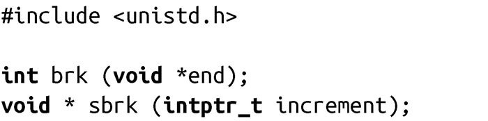

### 9.3　数据段的管理

UNIX系统在曾经提供过直接管理数据段的接口。但是，由于malloc()和其他分配机制更强大且易于使用，大多数程序都不会直接使用到这些接口。在这里提到这些接口是为了满足少数读者的好奇心，同时也为那些想自己实现基于堆的动态分配机制提供一些帮助：

这些函数继承了一些老版本UNIX系统中函数的名字，当时堆和栈还在同一个段中。堆中动态内存的分配由数据段的底部一直往上，栈从数据段的顶部一直往下。堆和栈的分界线叫做中断（break）或中断点（break point）。在现代系统中，数据段存在于它自己的内存映射中，我们仍用中断点来标记映射的结束地址。

调用brk()会把中断点（数据段的末端）的地址设置为end指定的值。成功时，该调用返回0。失败时，返回-1，并设置errno为ENOMEM。

调用sbrk()会在数据段的末端增加increment个字节，参数increment值可正可负。sbrk()函数返回修改后的断点。因此，当increment值为0时，可以得到如下的断点地址值：

尽管POSIX和C都没有定义这些函数，但几乎所有的UNIX系统都至少支持其中之一。可移植的程序应该坚持使用基于标准的接口。

