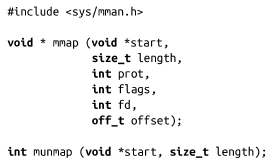
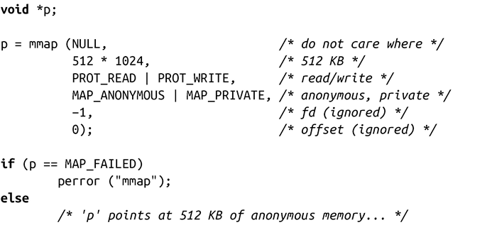
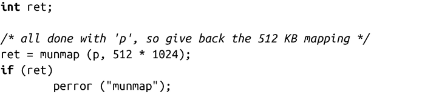

### 9.4.1　创建匿名内存映射

或许你在某次分配想要使用一个内存映射而不是堆，又或者你正在实现自己的内存分配系统，想要手工创建自己的匿名内存映射，不管怎么样，Linux都将让它变得非常简单。在第4章中，我们介绍了系统如何调用mmap()函数来创建内存映射，而用munmap()来销毁映射：

因为不需要打开和管理文件，创建匿名内存映射要比创建基于文件的内存映射更简单。两者最主要的区别在于是否有个特殊标记，表示该映射是匿名映射。

让我们来看看这个例子：

对于绝大多数的匿名映射而言，mmap()参数都和这个例子一样。当然了，传递的第二个参数值可以是任意大小（单位是字节）。其他参数大致如下：

+ 第一个参数是start，被设为NULL，表示内核可以把匿名映射放在任意地址上。当然，这里也可以指定一个non-NULL值，只要它是页对齐的，但这样做会限制可移植性。实际上，很少有程序会关心内存映射到哪个地址。
+ prot参数往往同时设置了PROT_READ和PROT_WRITE位，使得映射是可读可写的。一块不能读写的空内存映射是没有用的。此外，尽量避免将可执行代码映射到匿名映射，因为那样做可能产生潜在的安全漏洞。
+ flags参数设置MAP_ANONYMOUS位，使得映射是匿名的，并设置MAP_ PRIVATE位，使得映射是私有的。
+ 假如MAP_ANONYMOUS被设置了，fd和offset参数都将被忽略。然而，在一些更早的系统中，需要把fd值设置为-1，因此如果要考虑到程序的可移植性，那就把它设置为-1。

匿名映射获得的内存块，在使用上和通过堆获得的内存块一样。通过匿名映射进行分配的一个优点在于所有的页都已经用0进行了初始化。由于内核使用写时复制（copy-on-write）将内存块映射到了一个全0的页上，这样就避免了额外的开销。因此，也就没有必要对返回的内存块调用memset()。事实上，这是使用calloc()比先使用malloc()再使用memset()效率更高的原因之一：glibc知道匿名映射已经是全0了，在该映射上执行的calloc()调用就不再需要显式置零操作了。

系统调用munmap()释放一个匿名映射，归还已分配的内存给内核。

> 要想回顾一下mmap()、munmap()和一般映射的内容，请参阅第4章。

